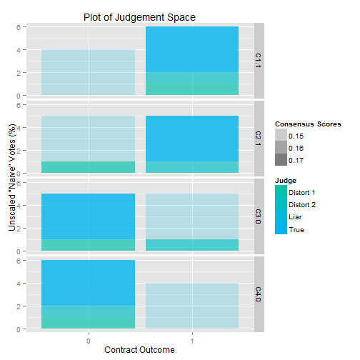

Tests, Results, and Commentary
========================================================
Dec 3, 2013


```r
# Cleanup
rm(list = ls())

# Load everything
try(setwd("~/Real/Programs/Decentralized Prediction Markets/Latest"))
source(file = "ConsensusMechanism.r")
```


Base
---------------


```r
Factory(Scenarios$Base)
```

```
## $Original
##           C1.1 C2.1 C3.0 C4.0
## True         1    1    0    0
## Distort 1    1    0    0    0
## True         1    1    0    0
## Distort 2    1    1    1    0
## Liar         0    0    1    1
## Liar         0    0    1    1
## 
## $Filled
##           C1.1 C2.1 C3.0 C4.0
## True         1    1    0    0
## Distort 1    1    0    0    0
## True         1    1    0    0
## Distort 2    1    1    1    0
## Liar         0    0    1    1
## Liar         0    0    1    1
## 
## $Agents
##           OldRep ThisRep SmoothRep NArow ParticipationR RelativePart
## True      0.1667  0.2824    0.1782     0              1       0.1667
## Distort 1 0.1667  0.2176    0.1718     0              1       0.1667
## True      0.1667  0.2824    0.1782     0              1       0.1667
## Distort 2 0.1667  0.2176    0.1718     0              1       0.1667
## Liar      0.1667  0.0000    0.1500     0              1       0.1667
## Liar      0.1667  0.0000    0.1500     0              1       0.1667
##           RowBonus
## True        0.1782
## Distort 1   0.1718
## True        0.1782
## Distort 2   0.1718
## Liar        0.1500
## Liar        0.1500
## 
## $Contracts
##                     C1.1      C2.1     C3.0   C4.0
## First Loading    -0.5395 -0.457056 0.457056 0.5395
## ConoutRAW         0.7000  0.528238 0.471762 0.3000
## Consensus Reward  0.4381  0.061860 0.061860 0.4381
## Certainty         0.1600  0.003189 0.003189 0.1600
## NAs Filled        0.0000  0.000000 0.000000 0.0000
## ParticipationC    1.0000  1.000000 1.000000 1.0000
## Contract Bonus    0.4381  0.061860 0.061860 0.4381
## ConoutFinal       1.0000  0.500000 0.500000 0.0000
```

```r
CompareIncentives(Scenarios$Base)
```

```
## [[1]]
##       Group OldRep SmoothRep      Drep
## 1      True 0.1667    0.1782  0.011571
## 2 Distort 1 0.1667    0.1718  0.005096
## 3      True 0.1667    0.1782  0.011571
## 4 Distort 2 0.1667    0.1718  0.005096
## 5      Liar 0.1667    0.1500 -0.016667
## 6      Liar 0.1667    0.1500 -0.016667
## 
## [[2]]
##       Group OldRep SmoothRep      Drep
## 4      True 0.3333    0.3565  0.023142
## 1 Distort 1 0.1667    0.1718  0.005096
## 2 Distort 2 0.1667    0.1718  0.005096
## 3      Liar 0.3333    0.3000 -0.033333
```

```r
# Good.
Chain(X = Scenarios$Base)
```

```
## [[1]]
## [[1]]$Original
##           C1.1 C2.1 C3.0 C4.0
## True         1    1    0    0
## Distort 1    1    0    0    0
## True         1    1    0    0
## Distort 2    1    1    1    0
## Liar         0    0    1    1
## Liar         0    0    1    1
## 
## [[1]]$Filled
##           C1.1 C2.1 C3.0 C4.0
## True         1    1    0    0
## Distort 1    1    0    0    0
## True         1    1    0    0
## Distort 2    1    1    1    0
## Liar         0    0    1    1
## Liar         0    0    1    1
## 
## [[1]]$Agents
##           OldRep ThisRep SmoothRep NArow ParticipationR RelativePart
## True      0.1667  0.2824    0.1782     0              1       0.1667
## Distort 1 0.1667  0.2176    0.1718     0              1       0.1667
## True      0.1667  0.2824    0.1782     0              1       0.1667
## Distort 2 0.1667  0.2176    0.1718     0              1       0.1667
## Liar      0.1667  0.0000    0.1500     0              1       0.1667
## Liar      0.1667  0.0000    0.1500     0              1       0.1667
##           RowBonus
## True        0.1782
## Distort 1   0.1718
## True        0.1782
## Distort 2   0.1718
## Liar        0.1500
## Liar        0.1500
## 
## [[1]]$Contracts
##                     C1.1      C2.1     C3.0   C4.0
## First Loading    -0.5395 -0.457056 0.457056 0.5395
## ConoutRAW         0.7000  0.528238 0.471762 0.3000
## Consensus Reward  0.4381  0.061860 0.061860 0.4381
## Certainty         0.1600  0.003189 0.003189 0.1600
## NAs Filled        0.0000  0.000000 0.000000 0.0000
## ParticipationC    1.0000  1.000000 1.000000 1.0000
## Contract Bonus    0.4381  0.061860 0.061860 0.4381
## ConoutFinal       1.0000  0.500000 0.500000 0.0000
## 
## 
## [[2]]
## [[2]]$Original
##           C1.1 C2.1 C3.0 C4.0
## True         1    1    0    0
## Distort 1    1    0    0    0
## True         1    1    0    0
## Distort 2    1    1    1    0
## Liar         0    0    1    1
## Liar         0    0    1    1
## 
## [[2]]$Filled
##           C1.1 C2.1 C3.0 C4.0
## True         1    1    0    0
## Distort 1    1    0    0    0
## True         1    1    0    0
## Distort 2    1    1    1    0
## Liar         0    0    1    1
## Liar         0    0    1    1
## 
## [[2]]$Agents
##           OldRep ThisRep SmoothRep NArow ParticipationR RelativePart
## True      0.1782  0.2873    0.1891     0              1       0.1667
## Distort 1 0.1718  0.2127    0.1759     0              1       0.1667
## True      0.1782  0.2873    0.1891     0              1       0.1667
## Distort 2 0.1718  0.2127    0.1759     0              1       0.1667
## Liar      0.1500  0.0000    0.1350     0              1       0.1667
## Liar      0.1500  0.0000    0.1350     0              1       0.1667
##           RowBonus
## True        0.1891
## Distort 1   0.1759
## True        0.1891
## Distort 2   0.1759
## Liar        0.1350
## Liar        0.1350
## 
## [[2]]$Contracts
##                     C1.1     C2.1    C3.0   C4.0
## First Loading    -0.5352 -0.46214 0.46214 0.5352
## ConoutRAW         0.7300  0.55414 0.44586 0.2700
## Consensus Reward  0.4047  0.09527 0.09527 0.4047
## Certainty         0.2116  0.01173 0.01173 0.2116
## NAs Filled        0.0000  0.00000 0.00000 0.0000
## ParticipationC    1.0000  1.00000 1.00000 1.0000
## Contract Bonus    0.4047  0.09527 0.09527 0.4047
## ConoutFinal       1.0000  1.00000 0.00000 0.0000
```

```r
PlotJ(M = Scenarios$Base)
```

```
## Loading required package: plyr
```

```
## Attaching package: 'reshape'
```

```
## The following object is masked from 'package:plyr':
## 
## rename, round_any
```

 


Very good. Conforms quickly to a correct prediction.
I'm thinking one block per day, or something, assuming we smooth difficulty correctly.

Reversed
---------------


```r
Factory(Scenarios$Reversed)
```

```
## $Original
##           C1.1 C2.1 C3.0 C4.0
## True         0    0    1    1
## Distort 1    0    1    1    1
## True         0    0    1    1
## Distort 2    0    0    0    1
## Liar         1    1    0    0
## Liar         1    1    0    0
## 
## $Filled
##           C1.1 C2.1 C3.0 C4.0
## True         0    0    1    1
## Distort 1    0    1    1    1
## True         0    0    1    1
## Distort 2    0    0    0    1
## Liar         1    1    0    0
## Liar         1    1    0    0
## 
## $Agents
##           OldRep ThisRep SmoothRep NArow ParticipationR RelativePart
## True      0.1667  0.2824    0.1782     0              1       0.1667
## Distort 1 0.1667  0.2176    0.1718     0              1       0.1667
## True      0.1667  0.2824    0.1782     0              1       0.1667
## Distort 2 0.1667  0.2176    0.1718     0              1       0.1667
## Liar      0.1667  0.0000    0.1500     0              1       0.1667
## Liar      0.1667  0.0000    0.1500     0              1       0.1667
##           RowBonus
## True        0.1782
## Distort 1   0.1718
## True        0.1782
## Distort 2   0.1718
## Liar        0.1500
## Liar        0.1500
## 
## $Contracts
##                     C1.1      C2.1     C3.0   C4.0
## First Loading    -0.5395 -0.457056 0.457056 0.5395
## ConoutRAW         0.3000  0.471762 0.528238 0.7000
## Consensus Reward  0.4381  0.061860 0.061860 0.4381
## Certainty         0.1600  0.003189 0.003189 0.1600
## NAs Filled        0.0000  0.000000 0.000000 0.0000
## ParticipationC    1.0000  1.000000 1.000000 1.0000
## Contract Bonus    0.4381  0.061860 0.061860 0.4381
## ConoutFinal       0.0000  0.500000 0.500000 1.0000
```

```r
all.equal(Factory(Scenarios$Reversed)$Agents, Factory(Scenarios$Base)$Agents)  #TRUE
```

```
## [1] TRUE
```

Identical incentive structure, despite reversed inputs and outputs.
Good.

One Liar
------------------

```r
Factory(Scenarios$Deviance)
```

```
## $Original
##      C1.1 C2.1 C3.0 C4.0
## True    1    1    0    0
## True    1    1    0    0
## True    1    1    0    0
## True    1    1    0    0
## Liar    0    0    1    1
## 
## $Filled
##      C1.1 C2.1 C3.0 C4.0
## True    1    1    0    0
## True    1    1    0    0
## True    1    1    0    0
## True    1    1    0    0
## Liar    0    0    1    1
## 
## $Agents
##      OldRep ThisRep SmoothRep NArow ParticipationR RelativePart RowBonus
## True    0.2    0.25     0.205     0              1          0.2    0.205
## True    0.2    0.25     0.205     0              1          0.2    0.205
## True    0.2    0.25     0.205     0              1          0.2    0.205
## True    0.2    0.25     0.205     0              1          0.2    0.205
## Liar    0.2    0.00     0.180     0              1          0.2    0.180
## 
## $Contracts
##                     C1.1    C2.1   C3.0   C4.0
## First Loading    -0.5000 -0.5000 0.5000 0.5000
## ConoutRAW         0.8200  0.8200 0.1800 0.1800
## Consensus Reward  0.2500  0.2500 0.2500 0.2500
## Certainty         0.4096  0.4096 0.4096 0.4096
## NAs Filled        0.0000  0.0000 0.0000 0.0000
## ParticipationC    1.0000  1.0000 1.0000 1.0000
## Contract Bonus    0.2500  0.2500 0.2500 0.2500
## ConoutFinal       1.0000  1.0000 0.0000 0.0000
```

Biggest Deviator gets CRUSHED to zero. High-Stakes!
Good.

Many Liars
-------------------


```r

Factory(Scenarios$CoalitionalDeviance)
```

```
## $Original
##       [,1] [,2] [,3] [,4]
## True     1    1    0    0
## True     1    1    0    0
## True     1    1    0    0
## True     1    1    0    0
## True     1    1    0    0
## True     1    1    0    0
## Diver    0    0    1    1
## Liar     1    1    1    0
## Liar     1    1    1    0
## Liar     1    1    1    0
## Liar     1    1    1    0
## 
## $Filled
##       [,1] [,2] [,3] [,4]
## True     1    1    0    0
## True     1    1    0    0
## True     1    1    0    0
## True     1    1    0    0
## True     1    1    0    0
## True     1    1    0    0
## Diver    0    0    1    1
## Liar     1    1    1    0
## Liar     1    1    1    0
## Liar     1    1    1    0
## Liar     1    1    1    0
## 
## $Agents
##        OldRep ThisRep SmoothRep NArow ParticipationR RelativePart RowBonus
## True  0.09091 0.11715   0.09353     0              1      0.09091  0.09353
## True  0.09091 0.11715   0.09353     0              1      0.09091  0.09353
## True  0.09091 0.11715   0.09353     0              1      0.09091  0.09353
## True  0.09091 0.11715   0.09353     0              1      0.09091  0.09353
## True  0.09091 0.11715   0.09353     0              1      0.09091  0.09353
## True  0.09091 0.11715   0.09353     0              1      0.09091  0.09353
## Diver 0.09091 0.00000   0.08182     0              1      0.09091  0.08182
## Liar  0.09091 0.07427   0.08925     0              1      0.09091  0.08925
## Liar  0.09091 0.07427   0.08925     0              1      0.09091  0.08925
## Liar  0.09091 0.07427   0.08925     0              1      0.09091  0.08925
## Liar  0.09091 0.07427   0.08925     0              1      0.09091  0.08925
## 
## $Contracts
##                     [,1]    [,2]    [,3]    [,4]
## First Loading    -0.4082 -0.4082 0.70711 0.40825
## ConoutRAW         0.9182  0.9182 0.43880 0.08182
## Consensus Reward  0.3178  0.3178 0.04651 0.31783
## Certainty         0.6995  0.6995 0.01498 0.69950
## NAs Filled        0.0000  0.0000 0.00000 0.00000
## ParticipationC    1.0000  1.0000 1.00000 1.00000
## Contract Bonus    0.3178  0.3178 0.04651 0.31783
## ConoutFinal       1.0000  1.0000 0.00000 0.00000
```

```r
# Success: An attempted <51% attack which failed.

Factory(Scenarios$CoalitionalDeviance2)
```

```
## $Original
##       [,1] [,2] [,3] [,4]
## True     1    1    0    0
## True     1    1    0    0
## True     1    1    0    0
## True     1    1    0    0
## True     1    1    0    0
## True     1    1    0    0
## Diver    0    0    0    1
## Liar     1    1    1    0
## Liar     1    1    1    0
## Liar     1    1    1    0
## Liar     1    1    1    0
## 
## $Filled
##       [,1] [,2] [,3] [,4]
## True     1    1    0    0
## True     1    1    0    0
## True     1    1    0    0
## True     1    1    0    0
## True     1    1    0    0
## True     1    1    0    0
## Diver    0    0    0    1
## Liar     1    1    1    0
## Liar     1    1    1    0
## Liar     1    1    1    0
## Liar     1    1    1    0
## 
## $Agents
##        OldRep ThisRep SmoothRep NArow ParticipationR RelativePart RowBonus
## True  0.09091 0.08333   0.09015     0              1      0.09091  0.09015
## True  0.09091 0.08333   0.09015     0              1      0.09091  0.09015
## True  0.09091 0.08333   0.09015     0              1      0.09091  0.09015
## True  0.09091 0.08333   0.09015     0              1      0.09091  0.09015
## True  0.09091 0.08333   0.09015     0              1      0.09091  0.09015
## True  0.09091 0.08333   0.09015     0              1      0.09091  0.09015
## Diver 0.09091 0.00000   0.08182     0              1      0.09091  0.08182
## Liar  0.09091 0.12500   0.09432     0              1      0.09091  0.09432
## Liar  0.09091 0.12500   0.09432     0              1      0.09091  0.09432
## Liar  0.09091 0.12500   0.09432     0              1      0.09091  0.09432
## Liar  0.09091 0.12500   0.09432     0              1      0.09091  0.09432
## 
## $Contracts
##                     [,1]    [,2]     [,3]    [,4]
## First Loading    -0.4364 -0.4364 -0.65465 0.43644
## ConoutRAW         0.9182  0.9182  0.37727 0.08182
## Consensus Reward  0.3036  0.3036  0.08911 0.30363
## Certainty         0.6995  0.6995  0.06025 0.69950
## NAs Filled        0.0000  0.0000  0.00000 0.00000
## ParticipationC    1.0000  1.0000  1.00000 1.00000
## Contract Bonus    0.3036  0.3036  0.08911 0.30363
## ConoutFinal       1.0000  1.0000  0.00000 0.00000
```

```r
# Oh, no: A Sucessful <51% attack 'Friendly Fire' ...will have to address
# this.

# Pre-Analytics
CompareIncentives(X = Scenarios$CoalitionalDeviance2)
```

```
## [[1]]
##    Group  OldRep SmoothRep       Drep
## 1   True 0.09091   0.09015 -0.0007576
## 2   True 0.09091   0.09015 -0.0007576
## 3   True 0.09091   0.09015 -0.0007576
## 4   True 0.09091   0.09015 -0.0007576
## 5   True 0.09091   0.09015 -0.0007576
## 6   True 0.09091   0.09015 -0.0007576
## 7  Diver 0.09091   0.08182 -0.0090909
## 8   Liar 0.09091   0.09432  0.0034091
## 9   Liar 0.09091   0.09432  0.0034091
## 10  Liar 0.09091   0.09432  0.0034091
## 11  Liar 0.09091   0.09432  0.0034091
## 
## [[2]]
##   Group  OldRep SmoothRep      Drep
## 2  Liar 0.36364   0.37727  0.013636
## 3  True 0.54545   0.54091 -0.004545
## 1 Diver 0.09091   0.08182 -0.009091
```

```r

row.names(Scenarios$CoalitionalDeviance2)[7] <- "Liar"
CompareIncentives(X = Scenarios$CoalitionalDeviance2)
```

```
## [[1]]
##    Group  OldRep SmoothRep       Drep
## 1   True 0.09091   0.09015 -0.0007576
## 2   True 0.09091   0.09015 -0.0007576
## 3   True 0.09091   0.09015 -0.0007576
## 4   True 0.09091   0.09015 -0.0007576
## 5   True 0.09091   0.09015 -0.0007576
## 6   True 0.09091   0.09015 -0.0007576
## 7   Liar 0.09091   0.08182 -0.0090909
## 8   Liar 0.09091   0.09432  0.0034091
## 9   Liar 0.09091   0.09432  0.0034091
## 10  Liar 0.09091   0.09432  0.0034091
## 11  Liar 0.09091   0.09432  0.0034091
## 
## [[2]]
##   Group OldRep SmoothRep      Drep
## 1  Liar 0.4545    0.4591  0.004545
## 2  True 0.5455    0.5409 -0.004545
```

```r

# [1] Success: 'Symmetric Friendly Fire' (ie Team truth forms a coalition
# of their own)
Scenarios$CoalitionalDeviance3 <- Scenarios$CoalitionalDeviance2
Scenarios$CoalitionalDeviance3[6, ] <- c(0, 0, 1, 1)

CompareIncentives(X = Scenarios$CoalitionalDeviance3)
```

```
## [[1]]
##    Group  OldRep SmoothRep      Drep
## 1   True 0.09091   0.09308  0.002170
## 2   True 0.09091   0.09308  0.002170
## 3   True 0.09091   0.09308  0.002170
## 4   True 0.09091   0.09308  0.002170
## 5   True 0.09091   0.09308  0.002170
## 6   True 0.09091   0.08182 -0.009091
## 7   Liar 0.09091   0.08227 -0.008643
## 8   Liar 0.09091   0.09263  0.001721
## 9   Liar 0.09091   0.09263  0.001721
## 10  Liar 0.09091   0.09263  0.001721
## 11  Liar 0.09091   0.09263  0.001721
## 
## [[2]]
##   Group OldRep SmoothRep      Drep
## 2  True 0.5455    0.5472  0.001757
## 1  Liar 0.4545    0.4528 -0.001757
```

  #Chain(Scenarios$CoalitionalDeviance3,N=100)
  #Team 'True' wins via symmetry-exploitation

```r
  # [2] Success: 'Cold Feet 1' (a single player abandons the coalition)
  Scenarios$CoalitionalDeviance4 <- Scenarios$CoalitionalDeviance2
  Scenarios$CoalitionalDeviance4[8,] <- c(1,1,0,0)
  
  CompareIncentives(X=Scenarios$CoalitionalDeviance4)
```

```
## [[1]]
##    Group  OldRep SmoothRep      Drep
## 1   True 0.09091   0.09091  0.000000
## 2   True 0.09091   0.09091  0.000000
## 3   True 0.09091   0.09091  0.000000
## 4   True 0.09091   0.09091  0.000000
## 5   True 0.09091   0.09091  0.000000
## 6   True 0.09091   0.09091  0.000000
## 7   Liar 0.09091   0.08182 -0.009091
## 8   Liar 0.09091   0.09091  0.000000
## 9   Liar 0.09091   0.09394  0.003030
## 10  Liar 0.09091   0.09394  0.003030
## 11  Liar 0.09091   0.09394  0.003030
## 
## [[2]]
##   Group OldRep SmoothRep      Drep
## 1  Liar 0.4545    0.4545 1.388e-17
## 2  True 0.5455    0.5455 0.000e+00
```

```r
  Ss <- Chain(Scenarios$CoalitionalDeviance4,N=70)[[70]]$Agents
  Ss <- data.frame(NewRep=as.numeric(Ss[,"NewRep"]),Group=row.names(Ss))
```

```
## Error: subscript out of bounds
```

```r
  aggregate(.~Group,data=Ss, FUN=sum)
```

```
## Error: object 'Group' not found
```

```r

  Scenarios$CoalitionalDeviance5 <- Scenarios$CoalitionalDeviance2
  Scenarios$CoalitionalDeviance5[8,] <- c(1,1,0,0)
  Scenarios$CoalitionalDeviance5[9,] <- c(1,1,0,0)

  CompareIncentives(X=Scenarios$CoalitionalDeviance5)
```

```
## [[1]]
##    Group  OldRep SmoothRep      Drep
## 1   True 0.09091   0.09152  0.000609
## 2   True 0.09091   0.09152  0.000609
## 3   True 0.09091   0.09152  0.000609
## 4   True 0.09091   0.09152  0.000609
## 5   True 0.09091   0.09152  0.000609
## 6   True 0.09091   0.09152  0.000609
## 7   Liar 0.09091   0.08182 -0.009091
## 8   Liar 0.09091   0.09152  0.000609
## 9   Liar 0.09091   0.09152  0.000609
## 10  Liar 0.09091   0.09302  0.002110
## 11  Liar 0.09091   0.09302  0.002110
## 
## [[2]]
##   Group OldRep SmoothRep      Drep
## 2  True 0.5455    0.5491  0.003654
## 1  Liar 0.4545    0.4509 -0.003654
```

```r
  Ss <- Chain(Scenarios$CoalitionalDeviance5,N=50)[[50]]$Agents
  Ss <- data.frame(NewRep=as.numeric(Ss[,"NewRep"]),Group=row.names(Ss))
```

```
## Error: subscript out of bounds
```

```r
  aggregate(.~Group,data=Ss, FUN=sum)
```

```
## Error: object 'Group' not found
```

```r
  #Notice after 50 rounds, the devil [=King of Liars] has actually become the two bottommost liars, as they represent the most significant source of confusion.
  #Team 'True' wins via stoicism

  #[3] Recursive Friendly Fire - a sub-coalition forms to defect, but a sub-coalition of this coalition forms to defect again.
  Scenarios$CoalitionalDeviance6 <- rbind(c(1,1,0,0,1),
                                          c(1,1,0,0,1),
                                          c(1,1,0,0,1),
                                          c(1,1,0,0,1),
                                          c(1,1,0,0,1),
                                          c(1,1,0,0,1),
                                          c(1,1,0,0,1),
                                          c(1,1,0,0,1),
                                          c(1,1,0,0,1),
                                          c(1,1,0,0,1), #10
                                          c(1,1,0,0,1),
                                          c(1,1,0,0,1),
                                          c(1,1,0,0,1),
                                          c(1,1,0,0,1),
                                          c(1,1,0,0,1), #15 (60%)
                                          
                                          #Coalition 1, backstabbing Truth to game contract 3
                                          c(0,0,0,1,0), #1 - Friendly Fire
                                          c(1,1,1,0,1),
                                          c(1,1,1,0,1),
                                          c(1,1,1,0,1),
                                          c(1,1,1,0,1),
                                          c(1,1,1,0,1), #6 (24%)
                                          
                                          #Coalition 2, 'backstabbing' Coalition 1 to game contract 4
                                          c(0,0,1,0,0), #1 - Friendly Fire
                                          c(1,1,0,1,1),
                                          c(1,1,0,1,1),
                                          c(1,1,0,1,1)) #4 (16%)

  row.names(Scenarios$CoalitionalDeviance6) <- c(rep('Truth',15),rep('Lie 1',6),rep('Lie 2',4))
  Factory(Scenarios$CoalitionalDeviance6)
```

```
## $Original
##       [,1] [,2] [,3] [,4] [,5]
## Truth    1    1    0    0    1
## Truth    1    1    0    0    1
## Truth    1    1    0    0    1
## Truth    1    1    0    0    1
## Truth    1    1    0    0    1
## Truth    1    1    0    0    1
## Truth    1    1    0    0    1
## Truth    1    1    0    0    1
## Truth    1    1    0    0    1
## Truth    1    1    0    0    1
## Truth    1    1    0    0    1
## Truth    1    1    0    0    1
## Truth    1    1    0    0    1
## Truth    1    1    0    0    1
## Truth    1    1    0    0    1
## Lie 1    0    0    0    1    0
## Lie 1    1    1    1    0    1
## Lie 1    1    1    1    0    1
## Lie 1    1    1    1    0    1
## Lie 1    1    1    1    0    1
## Lie 1    1    1    1    0    1
## Lie 2    0    0    1    0    0
## Lie 2    1    1    0    1    1
## Lie 2    1    1    0    1    1
## Lie 2    1    1    0    1    1
## 
## $Filled
##       [,1] [,2] [,3] [,4] [,5]
## Truth    1    1    0    0    1
## Truth    1    1    0    0    1
## Truth    1    1    0    0    1
## Truth    1    1    0    0    1
## Truth    1    1    0    0    1
## Truth    1    1    0    0    1
## Truth    1    1    0    0    1
## Truth    1    1    0    0    1
## Truth    1    1    0    0    1
## Truth    1    1    0    0    1
## Truth    1    1    0    0    1
## Truth    1    1    0    0    1
## Truth    1    1    0    0    1
## Truth    1    1    0    0    1
## Truth    1    1    0    0    1
## Lie 1    0    0    0    1    0
## Lie 1    1    1    1    0    1
## Lie 1    1    1    1    0    1
## Lie 1    1    1    1    0    1
## Lie 1    1    1    1    0    1
## Lie 1    1    1    1    0    1
## Lie 2    0    0    1    0    0
## Lie 2    1    1    0    1    1
## Lie 2    1    1    0    1    1
## Lie 2    1    1    0    1    1
## 
## $Agents
##       OldRep  ThisRep SmoothRep NArow ParticipationR RelativePart RowBonus
## Truth   0.04 0.046005   0.04060     0              1         0.04  0.04060
## Truth   0.04 0.046005   0.04060     0              1         0.04  0.04060
## Truth   0.04 0.046005   0.04060     0              1         0.04  0.04060
## Truth   0.04 0.046005   0.04060     0              1         0.04  0.04060
## Truth   0.04 0.046005   0.04060     0              1         0.04  0.04060
## Truth   0.04 0.046005   0.04060     0              1         0.04  0.04060
## Truth   0.04 0.046005   0.04060     0              1         0.04  0.04060
## Truth   0.04 0.046005   0.04060     0              1         0.04  0.04060
## Truth   0.04 0.046005   0.04060     0              1         0.04  0.04060
## Truth   0.04 0.046005   0.04060     0              1         0.04  0.04060
## Truth   0.04 0.046005   0.04060     0              1         0.04  0.04060
## Truth   0.04 0.046005   0.04060     0              1         0.04  0.04060
## Truth   0.04 0.046005   0.04060     0              1         0.04  0.04060
## Truth   0.04 0.046005   0.04060     0              1         0.04  0.04060
## Truth   0.04 0.046005   0.04060     0              1         0.04  0.04060
## Lie 1   0.04 0.002097   0.03621     0              1         0.04  0.03621
## Lie 1   0.04 0.037693   0.03977     0              1         0.04  0.03977
## Lie 1   0.04 0.037693   0.03977     0              1         0.04  0.03977
## Lie 1   0.04 0.037693   0.03977     0              1         0.04  0.03977
## Lie 1   0.04 0.037693   0.03977     0              1         0.04  0.03977
## Lie 1   0.04 0.037693   0.03977     0              1         0.04  0.03977
## Lie 2   0.04 0.000000   0.03600     0              1         0.04  0.03600
## Lie 2   0.04 0.039790   0.03998     0              1         0.04  0.03998
## Lie 2   0.04 0.039790   0.03998     0              1         0.04  0.03998
## Lie 2   0.04 0.039790   0.03998     0              1         0.04  0.03998
## 
## $Contracts
##                     [,1]    [,2]   [,3]   [,4]    [,5]
## First Loading    -0.5211 -0.5211 0.3447 0.2578 -0.5211
## ConoutRAW         0.9278  0.9278 0.2348 0.1561  0.9278
## Consensus Reward  0.2261  0.2261 0.1401 0.1817  0.2261
## Certainty         0.7320  0.7320 0.2812 0.4729  0.7320
## NAs Filled        0.0000  0.0000 0.0000 0.0000  0.0000
## ParticipationC    1.0000  1.0000 1.0000 1.0000  1.0000
## Contract Bonus    0.2261  0.2261 0.1401 0.1817  0.2261
## ConoutFinal       1.0000  1.0000 0.0000 0.0000  1.0000
```

```r
  CompareIncentives(Scenarios$CoalitionalDeviance6)
```

```
## [[1]]
##    Group OldRep SmoothRep       Drep
## 1  Truth   0.04   0.04060  6.005e-04
## 2  Truth   0.04   0.04060  6.005e-04
## 3  Truth   0.04   0.04060  6.005e-04
## 4  Truth   0.04   0.04060  6.005e-04
## 5  Truth   0.04   0.04060  6.005e-04
## 6  Truth   0.04   0.04060  6.005e-04
## 7  Truth   0.04   0.04060  6.005e-04
## 8  Truth   0.04   0.04060  6.005e-04
## 9  Truth   0.04   0.04060  6.005e-04
## 10 Truth   0.04   0.04060  6.005e-04
## 11 Truth   0.04   0.04060  6.005e-04
## 12 Truth   0.04   0.04060  6.005e-04
## 13 Truth   0.04   0.04060  6.005e-04
## 14 Truth   0.04   0.04060  6.005e-04
## 15 Truth   0.04   0.04060  6.005e-04
## 16 Lie 1   0.04   0.03621 -3.790e-03
## 17 Lie 1   0.04   0.03977 -2.307e-04
## 18 Lie 1   0.04   0.03977 -2.307e-04
## 19 Lie 1   0.04   0.03977 -2.307e-04
## 20 Lie 1   0.04   0.03977 -2.307e-04
## 21 Lie 1   0.04   0.03977 -2.307e-04
## 22 Lie 2   0.04   0.03600 -4.000e-03
## 23 Lie 2   0.04   0.03998 -2.101e-05
## 24 Lie 2   0.04   0.03998 -2.101e-05
## 25 Lie 2   0.04   0.03998 -2.101e-05
## 
## [[2]]
##   Group OldRep SmoothRep      Drep
## 3 Truth   0.60    0.6090  0.009007
## 2 Lie 2   0.16    0.1559 -0.004063
## 1 Lie 1   0.24    0.2351 -0.004944
```

```r
  #fantastic sucess...Lie 2 loses less

  #clearly, the Nash Equilibrium
  Scenarios$CoalitionalDeviance7 <- Scenarios$CoalitionalDeviance6[1:21,]
  Scenarios$CoalitionalDeviance7 <- rbind(Scenarios$CoalitionalDeviance7, rbind(
                                                                              'Truth 2'=c(1,1,0,0,1),
                                                                              'Truth 2'=c(1,1,0,0,1),
                                                                              'Truth 2'=c(1,1,0,0,1),
                                                                              'Truth 2'=c(1,1,0,0,1)))
  Factory(Scenarios$CoalitionalDeviance7)
```

```
## $Original
##         [,1] [,2] [,3] [,4] [,5]
## Truth      1    1    0    0    1
## Truth      1    1    0    0    1
## Truth      1    1    0    0    1
## Truth      1    1    0    0    1
## Truth      1    1    0    0    1
## Truth      1    1    0    0    1
## Truth      1    1    0    0    1
## Truth      1    1    0    0    1
## Truth      1    1    0    0    1
## Truth      1    1    0    0    1
## Truth      1    1    0    0    1
## Truth      1    1    0    0    1
## Truth      1    1    0    0    1
## Truth      1    1    0    0    1
## Truth      1    1    0    0    1
## Lie 1      0    0    0    1    0
## Lie 1      1    1    1    0    1
## Lie 1      1    1    1    0    1
## Lie 1      1    1    1    0    1
## Lie 1      1    1    1    0    1
## Lie 1      1    1    1    0    1
## Truth 2    1    1    0    0    1
## Truth 2    1    1    0    0    1
## Truth 2    1    1    0    0    1
## Truth 2    1    1    0    0    1
## 
## $Filled
##         [,1] [,2] [,3] [,4] [,5]
## Truth      1    1    0    0    1
## Truth      1    1    0    0    1
## Truth      1    1    0    0    1
## Truth      1    1    0    0    1
## Truth      1    1    0    0    1
## Truth      1    1    0    0    1
## Truth      1    1    0    0    1
## Truth      1    1    0    0    1
## Truth      1    1    0    0    1
## Truth      1    1    0    0    1
## Truth      1    1    0    0    1
## Truth      1    1    0    0    1
## Truth      1    1    0    0    1
## Truth      1    1    0    0    1
## Truth      1    1    0    0    1
## Lie 1      0    0    0    1    0
## Lie 1      1    1    1    0    1
## Lie 1      1    1    1    0    1
## Lie 1      1    1    1    0    1
## Lie 1      1    1    1    0    1
## Lie 1      1    1    1    0    1
## Truth 2    1    1    0    0    1
## Truth 2    1    1    0    0    1
## Truth 2    1    1    0    0    1
## Truth 2    1    1    0    0    1
## 
## $Agents
##         OldRep ThisRep SmoothRep NArow ParticipationR RelativePart
## Truth     0.04 0.04621   0.04062     0              1         0.04
## Truth     0.04 0.04621   0.04062     0              1         0.04
## Truth     0.04 0.04621   0.04062     0              1         0.04
## Truth     0.04 0.04621   0.04062     0              1         0.04
## Truth     0.04 0.04621   0.04062     0              1         0.04
## Truth     0.04 0.04621   0.04062     0              1         0.04
## Truth     0.04 0.04621   0.04062     0              1         0.04
## Truth     0.04 0.04621   0.04062     0              1         0.04
## Truth     0.04 0.04621   0.04062     0              1         0.04
## Truth     0.04 0.04621   0.04062     0              1         0.04
## Truth     0.04 0.04621   0.04062     0              1         0.04
## Truth     0.04 0.04621   0.04062     0              1         0.04
## Truth     0.04 0.04621   0.04062     0              1         0.04
## Truth     0.04 0.04621   0.04062     0              1         0.04
## Truth     0.04 0.04621   0.04062     0              1         0.04
## Lie 1     0.04 0.12198   0.04820     0              1         0.04
## Lie 1     0.04 0.00000   0.03600     0              1         0.04
## Lie 1     0.04 0.00000   0.03600     0              1         0.04
## Lie 1     0.04 0.00000   0.03600     0              1         0.04
## Lie 1     0.04 0.00000   0.03600     0              1         0.04
## Lie 1     0.04 0.00000   0.03600     0              1         0.04
## Truth 2   0.04 0.04621   0.04062     0              1         0.04
## Truth 2   0.04 0.04621   0.04062     0              1         0.04
## Truth 2   0.04 0.04621   0.04062     0              1         0.04
## Truth 2   0.04 0.04621   0.04062     0              1         0.04
##         RowBonus
## Truth    0.04062
## Truth    0.04062
## Truth    0.04062
## Truth    0.04062
## Truth    0.04062
## Truth    0.04062
## Truth    0.04062
## Truth    0.04062
## Truth    0.04062
## Truth    0.04062
## Truth    0.04062
## Truth    0.04062
## Truth    0.04062
## Truth    0.04062
## Truth    0.04062
## Lie 1    0.04820
## Lie 1    0.03600
## Lie 1    0.03600
## Lie 1    0.03600
## Lie 1    0.03600
## Lie 1    0.03600
## Truth 2  0.04062
## Truth 2  0.04062
## Truth 2  0.04062
## Truth 2  0.04062
## 
## $Contracts
##                     [,1]    [,2]    [,3]   [,4]    [,5]
## First Loading    -0.3170 -0.3170 -0.7733 0.3170 -0.3170
## ConoutRAW         0.9518  0.9518  0.1800 0.0482  0.9518
## Consensus Reward  0.2124  0.2124  0.1504 0.2124  0.2124
## Certainty         0.8165  0.8165  0.4096 0.8165  0.8165
## NAs Filled        0.0000  0.0000  0.0000 0.0000  0.0000
## ParticipationC    1.0000  1.0000  1.0000 1.0000  1.0000
## Contract Bonus    0.2124  0.2124  0.1504 0.2124  0.2124
## ConoutFinal       1.0000  1.0000  0.0000 0.0000  1.0000
```

```r
  CompareIncentives(Scenarios$CoalitionalDeviance7)
```

```
## [[1]]
##      Group OldRep SmoothRep       Drep
## 1    Truth   0.04   0.04062  0.0006212
## 2    Truth   0.04   0.04062  0.0006212
## 3    Truth   0.04   0.04062  0.0006212
## 4    Truth   0.04   0.04062  0.0006212
## 5    Truth   0.04   0.04062  0.0006212
## 6    Truth   0.04   0.04062  0.0006212
## 7    Truth   0.04   0.04062  0.0006212
## 8    Truth   0.04   0.04062  0.0006212
## 9    Truth   0.04   0.04062  0.0006212
## 10   Truth   0.04   0.04062  0.0006212
## 11   Truth   0.04   0.04062  0.0006212
## 12   Truth   0.04   0.04062  0.0006212
## 13   Truth   0.04   0.04062  0.0006212
## 14   Truth   0.04   0.04062  0.0006212
## 15   Truth   0.04   0.04062  0.0006212
## 16   Lie 1   0.04   0.04820  0.0081980
## 17   Lie 1   0.04   0.03600 -0.0040000
## 18   Lie 1   0.04   0.03600 -0.0040000
## 19   Lie 1   0.04   0.03600 -0.0040000
## 20   Lie 1   0.04   0.03600 -0.0040000
## 21   Lie 1   0.04   0.03600 -0.0040000
## 22 Truth 2   0.04   0.04062  0.0006212
## 23 Truth 2   0.04   0.04062  0.0006212
## 24 Truth 2   0.04   0.04062  0.0006212
## 25 Truth 2   0.04   0.04062  0.0006212
## 
## [[2]]
##     Group OldRep SmoothRep      Drep
## 2   Truth   0.60    0.6093  0.009317
## 3 Truth 2   0.16    0.1625  0.002485
## 1   Lie 1   0.24    0.2282 -0.011802
```

```r

  # [4] Passive - Sideways expansion by 2 contracts
  Scenarios$CoalitionalDeviance8 <- cbind(Scenarios$CoalitionalDeviance2,Scenarios$CoalitionalDeviance2[,1:2])
  Factory(Scenarios$CoalitionalDeviance8)
```

```
## $Original
##      [,1] [,2] [,3] [,4] [,5] [,6]
## True    1    1    0    0    1    1
## True    1    1    0    0    1    1
## True    1    1    0    0    1    1
## True    1    1    0    0    1    1
## True    1    1    0    0    1    1
## True    1    1    0    0    1    1
## Liar    0    0    0    1    0    0
## Liar    1    1    1    0    1    1
## Liar    1    1    1    0    1    1
## Liar    1    1    1    0    1    1
## Liar    1    1    1    0    1    1
## 
## $Filled
##      [,1] [,2] [,3] [,4] [,5] [,6]
## True    1    1    0    0    1    1
## True    1    1    0    0    1    1
## True    1    1    0    0    1    1
## True    1    1    0    0    1    1
## True    1    1    0    0    1    1
## True    1    1    0    0    1    1
## Liar    0    0    0    1    0    0
## Liar    1    1    1    0    1    1
## Liar    1    1    1    0    1    1
## Liar    1    1    1    0    1    1
## Liar    1    1    1    0    1    1
## 
## $Agents
##       OldRep ThisRep SmoothRep NArow ParticipationR RelativePart RowBonus
## True 0.09091 0.09402   0.09122     0              1      0.09091  0.09122
## True 0.09091 0.09402   0.09122     0              1      0.09091  0.09122
## True 0.09091 0.09402   0.09122     0              1      0.09091  0.09122
## True 0.09091 0.09402   0.09122     0              1      0.09091  0.09122
## True 0.09091 0.09402   0.09122     0              1      0.09091  0.09122
## True 0.09091 0.09402   0.09122     0              1      0.09091  0.09122
## Liar 0.09091 0.00000   0.08182     0              1      0.09091  0.08182
## Liar 0.09091 0.10896   0.09271     0              1      0.09091  0.09271
## Liar 0.09091 0.10896   0.09271     0              1      0.09091  0.09271
## Liar 0.09091 0.10896   0.09271     0              1      0.09091  0.09271
## Liar 0.09091 0.10896   0.09271     0              1      0.09091  0.09271
## 
## $Contracts
##                     [,1]    [,2]     [,3]    [,4]    [,5]    [,6]
## First Loading    -0.4214 -0.4214 -0.33475 0.42141 -0.4214 -0.4214
## ConoutRAW         0.9182  0.9182  0.37086 0.08182  0.9182  0.9182
## Consensus Reward  0.1884  0.1884  0.05817 0.18837  0.1884  0.1884
## Certainty         0.6995  0.6995  0.06671 0.69950  0.6995  0.6995
## NAs Filled        0.0000  0.0000  0.00000 0.00000  0.0000  0.0000
## ParticipationC    1.0000  1.0000  1.00000 1.00000  1.0000  1.0000
## Contract Bonus    0.1884  0.1884  0.05817 0.18837  0.1884  0.1884
## ConoutFinal       1.0000  1.0000  0.00000 0.00000  1.0000  1.0000
```

```r
  CompareIncentives(Scenarios$CoalitionalDeviance8)   
```

```
## [[1]]
##    Group  OldRep SmoothRep       Drep
## 1   True 0.09091   0.09122  0.0003116
## 2   True 0.09091   0.09122  0.0003116
## 3   True 0.09091   0.09122  0.0003116
## 4   True 0.09091   0.09122  0.0003116
## 5   True 0.09091   0.09122  0.0003116
## 6   True 0.09091   0.09122  0.0003116
## 7   Liar 0.09091   0.08182 -0.0090909
## 8   Liar 0.09091   0.09271  0.0018054
## 9   Liar 0.09091   0.09271  0.0018054
## 10  Liar 0.09091   0.09271  0.0018054
## 11  Liar 0.09091   0.09271  0.0018054
## 
## [[2]]
##   Group OldRep SmoothRep      Drep
## 2  True 0.5455    0.5473  0.001869
## 1  Liar 0.4545    0.4527 -0.001869
```

```r
  #Success, larger number of contracts makes this attack improbable.

  Scenarios$CoalitionalDeviance9 <- cbind(Scenarios$CoalitionalDeviance2,
                                          Scenarios$CoalitionalDeviance2,
                                          Scenarios$CoalitionalDeviance2,
                                          Scenarios$CoalitionalDeviance2[,-3])
  Factory(Scenarios$CoalitionalDeviance9)
```

```
## $Original
##      [,1] [,2] [,3] [,4] [,5] [,6] [,7] [,8] [,9] [,10] [,11] [,12] [,13]
## True    1    1    0    0    1    1    0    0    1     1     0     0     1
## True    1    1    0    0    1    1    0    0    1     1     0     0     1
## True    1    1    0    0    1    1    0    0    1     1     0     0     1
## True    1    1    0    0    1    1    0    0    1     1     0     0     1
## True    1    1    0    0    1    1    0    0    1     1     0     0     1
## True    1    1    0    0    1    1    0    0    1     1     0     0     1
## Liar    0    0    0    1    0    0    0    1    0     0     0     1     0
## Liar    1    1    1    0    1    1    1    0    1     1     1     0     1
## Liar    1    1    1    0    1    1    1    0    1     1     1     0     1
## Liar    1    1    1    0    1    1    1    0    1     1     1     0     1
## Liar    1    1    1    0    1    1    1    0    1     1     1     0     1
##      [,14] [,15]
## True     1     0
## True     1     0
## True     1     0
## True     1     0
## True     1     0
## True     1     0
## Liar     0     1
## Liar     1     0
## Liar     1     0
## Liar     1     0
## Liar     1     0
## 
## $Filled
##      [,1] [,2] [,3] [,4] [,5] [,6] [,7] [,8] [,9] [,10] [,11] [,12] [,13]
## True    1    1    0    0    1    1    0    0    1     1     0     0     1
## True    1    1    0    0    1    1    0    0    1     1     0     0     1
## True    1    1    0    0    1    1    0    0    1     1     0     0     1
## True    1    1    0    0    1    1    0    0    1     1     0     0     1
## True    1    1    0    0    1    1    0    0    1     1     0     0     1
## True    1    1    0    0    1    1    0    0    1     1     0     0     1
## Liar    0    0    0    1    0    0    0    1    0     0     0     1     0
## Liar    1    1    1    0    1    1    1    0    1     1     1     0     1
## Liar    1    1    1    0    1    1    1    0    1     1     1     0     1
## Liar    1    1    1    0    1    1    1    0    1     1     1     0     1
## Liar    1    1    1    0    1    1    1    0    1     1     1     0     1
##      [,14] [,15]
## True     1     0
## True     1     0
## True     1     0
## True     1     0
## True     1     0
## True     1     0
## Liar     0     1
## Liar     1     0
## Liar     1     0
## Liar     1     0
## Liar     1     0
## 
## $Agents
##       OldRep ThisRep SmoothRep NArow ParticipationR RelativePart RowBonus
## True 0.09091 0.09091   0.09091     0              1      0.09091  0.09091
## True 0.09091 0.09091   0.09091     0              1      0.09091  0.09091
## True 0.09091 0.09091   0.09091     0              1      0.09091  0.09091
## True 0.09091 0.09091   0.09091     0              1      0.09091  0.09091
## True 0.09091 0.09091   0.09091     0              1      0.09091  0.09091
## True 0.09091 0.09091   0.09091     0              1      0.09091  0.09091
## Liar 0.09091 0.00000   0.08182     0              1      0.09091  0.08182
## Liar 0.09091 0.11364   0.09318     0              1      0.09091  0.09318
## Liar 0.09091 0.11364   0.09318     0              1      0.09091  0.09318
## Liar 0.09091 0.11364   0.09318     0              1      0.09091  0.09318
## Liar 0.09091 0.11364   0.09318     0              1      0.09091  0.09318
## 
## $Contracts
##                      [,1]     [,2]     [,3]    [,4]     [,5]     [,6]
## First Loading    -0.25820 -0.25820 -0.25820 0.25820 -0.25820 -0.25820
## ConoutRAW         0.91818  0.91818  0.37273 0.08182  0.91818  0.91818
## Consensus Reward  0.07744  0.07744  0.02357 0.07744  0.07744  0.07744
## Certainty         0.69950  0.69950  0.06479 0.69950  0.69950  0.69950
## NAs Filled        0.00000  0.00000  0.00000 0.00000  0.00000  0.00000
## ParticipationC    1.00000  1.00000  1.00000 1.00000  1.00000  1.00000
## Contract Bonus    0.07744  0.07744  0.02357 0.07744  0.07744  0.07744
## ConoutFinal       1.00000  1.00000  0.00000 0.00000  1.00000  1.00000
##                      [,7]    [,8]     [,9]    [,10]    [,11]   [,12]
## First Loading    -0.25820 0.25820 -0.25820 -0.25820 -0.25820 0.25820
## ConoutRAW         0.37273 0.08182  0.91818  0.91818  0.37273 0.08182
## Consensus Reward  0.02357 0.07744  0.07744  0.07744  0.02357 0.07744
## Certainty         0.06479 0.69950  0.69950  0.69950  0.06479 0.69950
## NAs Filled        0.00000 0.00000  0.00000  0.00000  0.00000 0.00000
## ParticipationC    1.00000 1.00000  1.00000  1.00000  1.00000 1.00000
## Contract Bonus    0.02357 0.07744  0.07744  0.07744  0.02357 0.07744
## ConoutFinal       0.00000 0.00000  1.00000  1.00000  0.00000 0.00000
##                     [,13]    [,14]   [,15]
## First Loading    -0.25820 -0.25820 0.25820
## ConoutRAW         0.91818  0.91818 0.08182
## Consensus Reward  0.07744  0.07744 0.07744
## Certainty         0.69950  0.69950 0.69950
## NAs Filled        0.00000  0.00000 0.00000
## ParticipationC    1.00000  1.00000 1.00000
## Contract Bonus    0.07744  0.07744 0.07744
## ConoutFinal       1.00000  1.00000 0.00000
```

```r
  CompareIncentives(Scenarios$CoalitionalDeviance9)
```

```
## [[1]]
##    Group  OldRep SmoothRep      Drep
## 1   True 0.09091   0.09091  0.000000
## 2   True 0.09091   0.09091  0.000000
## 3   True 0.09091   0.09091  0.000000
## 4   True 0.09091   0.09091  0.000000
## 5   True 0.09091   0.09091  0.000000
## 6   True 0.09091   0.09091  0.000000
## 7   Liar 0.09091   0.08182 -0.009091
## 8   Liar 0.09091   0.09318  0.002273
## 9   Liar 0.09091   0.09318  0.002273
## 10  Liar 0.09091   0.09318  0.002273
## 11  Liar 0.09091   0.09318  0.002273
## 
## [[2]]
##   Group OldRep SmoothRep Drep
## 1  Liar 0.4545    0.4545    0
## 2  True 0.5455    0.5455    0
```

```r
  #The attack must expand proportionally.
```


Uninformed People
------------------


```r
Factory(Scenarios$CluelessControl)
```

```
## $Original
##      C1.1 C2.1 C3.0 C4.0
## True    1    1    0    0
## True    1    1    0    0
## True    1    1    0    0
## True    1    1    0    0
## True    1    1    0    0
## True    1    1    0    0
## True    1    1    0    0
## 
## $Filled
##      C1.1 C2.1 C3.0 C4.0
## True    1    1    0    0
## True    1    1    0    0
## True    1    1    0    0
## True    1    1    0    0
## True    1    1    0    0
## True    1    1    0    0
## True    1    1    0    0
## 
## $Agents
##      OldRep ThisRep SmoothRep NArow ParticipationR RelativePart RowBonus
## True 0.1429  0.1429    0.1429     0              1       0.1429   0.1429
## True 0.1429  0.1429    0.1429     0              1       0.1429   0.1429
## True 0.1429  0.1429    0.1429     0              1       0.1429   0.1429
## True 0.1429  0.1429    0.1429     0              1       0.1429   0.1429
## True 0.1429  0.1429    0.1429     0              1       0.1429   0.1429
## True 0.1429  0.1429    0.1429     0              1       0.1429   0.1429
## True 0.1429  0.1429    0.1429     0              1       0.1429   0.1429
## 
## $Contracts
##                  C1.1 C2.1 C3.0 C4.0
## First Loading    1.00 0.00 0.00 0.00
## ConoutRAW        1.00 1.00 0.00 0.00
## Consensus Reward 0.25 0.25 0.25 0.25
## Certainty        1.00 1.00 1.00 1.00
## NAs Filled       0.00 0.00 0.00 0.00
## ParticipationC   1.00 1.00 1.00 1.00
## Contract Bonus   0.25 0.25 0.25 0.25
## ConoutFinal      1.00 1.00 0.00 0.00
```

```r
Factory(Scenarios$CluelessTest)
```

```
## $Original
##      C1.1 C2.1 C3.0 C4.0
## True    1    1    0    0
## True    1   NA    0    0
## True    1    1    0    0
## True    1    1    0    0
## True    1    1    0    0
## True    1    1    0    0
## True    1    1    0    0
## 
## $Filled
##      C1.1 C2.1 C3.0 C4.0
## True    1    1    0    0
## True    1    1    0    0
## True    1    1    0    0
## True    1    1    0    0
## True    1    1    0    0
## True    1    1    0    0
## True    1    1    0    0
## 
## $Agents
##      OldRep ThisRep SmoothRep NArow ParticipationR RelativePart RowBonus
## True 0.1429  0.1429    0.1429     0           1.00       0.1481   0.1430
## True 0.1429  0.1429    0.1429     1           0.75       0.1111   0.1417
## True 0.1429  0.1429    0.1429     0           1.00       0.1481   0.1430
## True 0.1429  0.1429    0.1429     0           1.00       0.1481   0.1430
## True 0.1429  0.1429    0.1429     0           1.00       0.1481   0.1430
## True 0.1429  0.1429    0.1429     0           1.00       0.1481   0.1430
## True 0.1429  0.1429    0.1429     0           1.00       0.1481   0.1430
## 
## $Contracts
##                    C1.1   C2.1   C3.0   C4.0
## First Loading    1.0000 0.0000 0.0000 0.0000
## ConoutRAW        1.0000 1.0000 0.0000 0.0000
## Consensus Reward 0.2500 0.2500 0.2500 0.2500
## Certainty        1.0000 1.0000 1.0000 1.0000
## NAs Filled       0.0000 1.0000 0.0000 0.0000
## ParticipationC   1.0000 0.8571 1.0000 1.0000
## Contract Bonus   0.2503 0.2490 0.2503 0.2503
## ConoutFinal      1.0000 1.0000 0.0000 0.0000
```

Finding: 2 falls from tie at 5th .11 to a tie at 7th with .07; no impact on other results: success.

Note: Must be a discrete set of options: c(1,0,NA,.5)    ---- !!! by extention, Catch must be implemented in FillNA. Indeed, in this example our lazy character is punished twice.
otherwise there will likely be pragmatic individuals who rationally deviate to answers like ~.85 or ~.92 or some nonsense. [obviously]

Overwhelming Incoherence
--------------------------

```r

Factory(Scenarios$Incoherence)
```

```
## $Original
##      C1.1 C2.1 C3.0 C4.0
## True    1  0.5    0    0
## True    1  0.5    0    0
## True    1  1.0    0    0
## True    1  0.5    0    0
## True    1  0.5    0    0
## True    1  0.5    0    0
## True    1  0.5    0    0
## 
## $Filled
##      C1.1 C2.1 C3.0 C4.0
## True    1  0.5    0    0
## True    1  0.5    0    0
## True    1  1.0    0    0
## True    1  0.5    0    0
## True    1  0.5    0    0
## True    1  0.5    0    0
## True    1  0.5    0    0
## 
## $Agents
##      OldRep ThisRep SmoothRep NArow ParticipationR RelativePart RowBonus
## True 0.1429  0.1667    0.1452     0              1       0.1429   0.1452
## True 0.1429  0.1667    0.1452     0              1       0.1429   0.1452
## True 0.1429  0.0000    0.1286     0              1       0.1429   0.1286
## True 0.1429  0.1667    0.1452     0              1       0.1429   0.1452
## True 0.1429  0.1667    0.1452     0              1       0.1429   0.1452
## True 0.1429  0.1667    0.1452     0              1       0.1429   0.1452
## True 0.1429  0.1667    0.1452     0              1       0.1429   0.1452
## 
## $Contracts
##                    C1.1    C2.1   C3.0   C4.0
## First Loading    0.0000 1.00000 0.0000 0.0000
## ConoutRAW        1.0000 0.56429 0.0000 0.0000
## Consensus Reward 0.3196 0.04110 0.3196 0.3196
## Certainty        1.0000 0.01653 1.0000 1.0000
## NAs Filled       0.0000 0.00000 0.0000 0.0000
## ParticipationC   1.0000 1.00000 1.0000 1.0000
## Contract Bonus   0.3196 0.04110 0.3196 0.3196
## ConoutFinal      1.0000 1.00000 0.0000 0.0000
```

```r
Factory(Scenarios$Incoherence2)
```

```
## $Original
##      C1.1 C2.1 C3.0 C4.0
## True    1  0.5    0    0
## True    1  0.5    0    0
## True    1  1.0    0    0
## True    1  0.5    0    0
## True    1  0.5    0    0
## True    1  0.5    0    0
## True    1  0.0    0    0
## 
## $Filled
##      C1.1 C2.1 C3.0 C4.0
## True    1  0.5    0    0
## True    1  0.5    0    0
## True    1  1.0    0    0
## True    1  0.5    0    0
## True    1  0.5    0    0
## True    1  0.5    0    0
## True    1  0.0    0    0
## 
## $Agents
##      OldRep ThisRep SmoothRep NArow ParticipationR RelativePart RowBonus
## True 0.1429  0.1429    0.1429     0              1       0.1429   0.1429
## True 0.1429  0.1429    0.1429     0              1       0.1429   0.1429
## True 0.1429  0.0000    0.1286     0              1       0.1429   0.1286
## True 0.1429  0.1429    0.1429     0              1       0.1429   0.1429
## True 0.1429  0.1429    0.1429     0              1       0.1429   0.1429
## True 0.1429  0.1429    0.1429     0              1       0.1429   0.1429
## True 0.1429  0.2857    0.1571     0              1       0.1429   0.1571
## 
## $Contracts
##                    C1.1      C2.1   C3.0   C4.0
## First Loading    0.0000 1.0000000 0.0000 0.0000
## ConoutRAW        1.0000 0.4857143 0.0000 0.0000
## Consensus Reward 0.3302 0.0094340 0.3302 0.3302
## Certainty        1.0000 0.0008163 1.0000 1.0000
## NAs Filled       0.0000 0.0000000 0.0000 0.0000
## ParticipationC   1.0000 1.0000000 1.0000 1.0000
## Contract Bonus   0.3302 0.0094340 0.3302 0.3302
## ConoutFinal      1.0000 0.5000000 0.0000 0.0000
```

Interesting behavior, but incentive compatible, particularly given low Schelling Salience
Incentive to switch to the consensus .5

Perfect Consensus
--------------------

```r
Factory(Scenarios$PerCon)
```

```
## $Original
##      C1.1 C2.1 C3.0 C4.0
## [1,]    1    1    0    0
## [2,]    1    1    0    0
## [3,]    1    1    0    0
## [4,]    1    1    0    0
## 
## $Filled
##      C1.1 C2.1 C3.0 C4.0
## [1,]    1    1    0    0
## [2,]    1    1    0    0
## [3,]    1    1    0    0
## [4,]    1    1    0    0
## 
## $Agents
##      OldRep ThisRep SmoothRep NArow ParticipationR RelativePart RowBonus
## [1,]   0.25    0.25      0.25     0              1         0.25     0.25
## [2,]   0.25    0.25      0.25     0              1         0.25     0.25
## [3,]   0.25    0.25      0.25     0              1         0.25     0.25
## [4,]   0.25    0.25      0.25     0              1         0.25     0.25
## 
## $Contracts
##                  C1.1 C2.1 C3.0 C4.0
## First Loading    1.00 0.00 0.00 0.00
## ConoutRAW        1.00 1.00 0.00 0.00
## Consensus Reward 0.25 0.25 0.25 0.25
## Certainty        1.00 1.00 1.00 1.00
## NAs Filled       0.00 0.00 0.00 0.00
## ParticipationC   1.00 1.00 1.00 1.00
## Contract Bonus   0.25 0.25 0.25 0.25
## ConoutFinal      1.00 1.00 0.00 0.00
```

```r
# No problems.
```


Gaming
----------------

```r

Factory(Scenarios$Gaming)
```

```
## $Original
##           C1.1 C2.1 C3.0 C4.0 C0.5 C0.5 C0.5 C0.5 C0.5 C0.5 C0.5 C0.5
## True         1    1    0    0  0.5  0.5  0.5  0.5  0.5  0.5  0.5  0.5
## Distort 1    1    0    0    0  0.5  0.5  0.5  0.5  0.5  0.5  0.5  0.5
## True         1    1    0    0  0.5  0.5  0.5  0.5  0.5  0.5  0.5  0.5
## Distort 2    1    1    1    0  0.5  0.5  0.5  0.5  0.5  0.5  0.5  0.5
## Liar         0    0    1    1  0.0  1.0  0.0  1.0  0.0  1.0  0.0  1.0
## Liar         0    0    1    1  1.0  0.0  1.0  0.0  1.0  0.0  1.0  0.0
## True         1    1    0    0  0.5  0.5  0.5  0.5  0.5  0.5  0.5  0.5
## Distort 1    1    0    0    0  0.5  0.5  0.5  0.5  0.5  0.5  0.5  0.5
## True         1    1    0    0  0.5  0.5  0.5  0.5  0.5  0.5  0.5  0.5
## Distort 2    1    1    1    0  0.5  0.5  0.5  0.5  0.5  0.5  0.5  0.5
## Liar         0    0    1    1  0.0  1.0  0.0  1.0  0.0  1.0  0.0  1.0
## Liar         0    0    1    1  1.0  0.0  1.0  0.0  1.0  0.0  1.0  0.0
## True         1    1    0    0  0.5  0.5  0.5  0.5  0.5  0.5  0.5  0.5
## Distort 1    1    0    0    0  0.5  0.5  0.5  0.5  0.5  0.5  0.5  0.5
## True         1    1    0    0  0.5  0.5  0.5  0.5  0.5  0.5  0.5  0.5
## Distort 2    1    1    1    0  0.5  0.5  0.5  0.5  0.5  0.5  0.5  0.5
## Liar         0    0    1    1  0.0  1.0  0.0  1.0  0.0  1.0  0.0  1.0
## Liar         0    0    1    1  1.0  0.0  1.0  0.0  1.0  0.0  1.0  0.0
## True         1    1    0    0  0.5  0.5  0.5  0.5  0.5  0.5  0.5  0.5
## Distort 1    1    0    0    0  0.5  0.5  0.5  0.5  0.5  0.5  0.5  0.5
## True         1    1    0    0  0.5  0.5  0.5  0.5  0.5  0.5  0.5  0.5
## Distort 2    1    1    1    0  0.5  0.5  0.5  0.5  0.5  0.5  0.5  0.5
## Liar         0    0    1    1  0.0  1.0  0.0  1.0  0.0  1.0  0.0  1.0
## Liar         0    0    1    1  1.0  0.0  1.0  0.0  1.0  0.0  1.0  0.0
## 
## $Filled
##           C1.1 C2.1 C3.0 C4.0 C0.5 C0.5 C0.5 C0.5 C0.5 C0.5 C0.5 C0.5
## True         1    1    0    0  0.5  0.5  0.5  0.5  0.5  0.5  0.5  0.5
## Distort 1    1    0    0    0  0.5  0.5  0.5  0.5  0.5  0.5  0.5  0.5
## True         1    1    0    0  0.5  0.5  0.5  0.5  0.5  0.5  0.5  0.5
## Distort 2    1    1    1    0  0.5  0.5  0.5  0.5  0.5  0.5  0.5  0.5
## Liar         0    0    1    1  0.0  1.0  0.0  1.0  0.0  1.0  0.0  1.0
## Liar         0    0    1    1  1.0  0.0  1.0  0.0  1.0  0.0  1.0  0.0
## True         1    1    0    0  0.5  0.5  0.5  0.5  0.5  0.5  0.5  0.5
## Distort 1    1    0    0    0  0.5  0.5  0.5  0.5  0.5  0.5  0.5  0.5
## True         1    1    0    0  0.5  0.5  0.5  0.5  0.5  0.5  0.5  0.5
## Distort 2    1    1    1    0  0.5  0.5  0.5  0.5  0.5  0.5  0.5  0.5
## Liar         0    0    1    1  0.0  1.0  0.0  1.0  0.0  1.0  0.0  1.0
## Liar         0    0    1    1  1.0  0.0  1.0  0.0  1.0  0.0  1.0  0.0
## True         1    1    0    0  0.5  0.5  0.5  0.5  0.5  0.5  0.5  0.5
## Distort 1    1    0    0    0  0.5  0.5  0.5  0.5  0.5  0.5  0.5  0.5
## True         1    1    0    0  0.5  0.5  0.5  0.5  0.5  0.5  0.5  0.5
## Distort 2    1    1    1    0  0.5  0.5  0.5  0.5  0.5  0.5  0.5  0.5
## Liar         0    0    1    1  0.0  1.0  0.0  1.0  0.0  1.0  0.0  1.0
## Liar         0    0    1    1  1.0  0.0  1.0  0.0  1.0  0.0  1.0  0.0
## True         1    1    0    0  0.5  0.5  0.5  0.5  0.5  0.5  0.5  0.5
## Distort 1    1    0    0    0  0.5  0.5  0.5  0.5  0.5  0.5  0.5  0.5
## True         1    1    0    0  0.5  0.5  0.5  0.5  0.5  0.5  0.5  0.5
## Distort 2    1    1    1    0  0.5  0.5  0.5  0.5  0.5  0.5  0.5  0.5
## Liar         0    0    1    1  0.0  1.0  0.0  1.0  0.0  1.0  0.0  1.0
## Liar         0    0    1    1  1.0  0.0  1.0  0.0  1.0  0.0  1.0  0.0
## 
## $Agents
##            OldRep ThisRep SmoothRep NArow ParticipationR RelativePart
## True      0.04167 0.07059   0.04456     0              1      0.04167
## Distort 1 0.04167 0.05441   0.04294     0              1      0.04167
## True      0.04167 0.07059   0.04456     0              1      0.04167
## Distort 2 0.04167 0.05441   0.04294     0              1      0.04167
## Liar      0.04167 0.00000   0.03750     0              1      0.04167
## Liar      0.04167 0.00000   0.03750     0              1      0.04167
## True      0.04167 0.07059   0.04456     0              1      0.04167
## Distort 1 0.04167 0.05441   0.04294     0              1      0.04167
## True      0.04167 0.07059   0.04456     0              1      0.04167
## Distort 2 0.04167 0.05441   0.04294     0              1      0.04167
## Liar      0.04167 0.00000   0.03750     0              1      0.04167
## Liar      0.04167 0.00000   0.03750     0              1      0.04167
## True      0.04167 0.07059   0.04456     0              1      0.04167
## Distort 1 0.04167 0.05441   0.04294     0              1      0.04167
## True      0.04167 0.07059   0.04456     0              1      0.04167
## Distort 2 0.04167 0.05441   0.04294     0              1      0.04167
## Liar      0.04167 0.00000   0.03750     0              1      0.04167
## Liar      0.04167 0.00000   0.03750     0              1      0.04167
## True      0.04167 0.07059   0.04456     0              1      0.04167
## Distort 1 0.04167 0.05441   0.04294     0              1      0.04167
## True      0.04167 0.07059   0.04456     0              1      0.04167
## Distort 2 0.04167 0.05441   0.04294     0              1      0.04167
## Liar      0.04167 0.00000   0.03750     0              1      0.04167
## Liar      0.04167 0.00000   0.03750     0              1      0.04167
##           RowBonus
## True       0.04456
## Distort 1  0.04294
## True       0.04456
## Distort 2  0.04294
## Liar       0.03750
## Liar       0.03750
## True       0.04456
## Distort 1  0.04294
## True       0.04456
## Distort 2  0.04294
## Liar       0.03750
## Liar       0.03750
## True       0.04456
## Distort 1  0.04294
## True       0.04456
## Distort 2  0.04294
## Liar       0.03750
## Liar       0.03750
## True       0.04456
## Distort 1  0.04294
## True       0.04456
## Distort 2  0.04294
## Liar       0.03750
## Liar       0.03750
## 
## $Contracts
##                     C1.1      C2.1     C3.0   C4.0 C0.5 C0.5 C0.5 C0.5
## First Loading    -0.5395 -0.457056 0.457056 0.5395  0.0  0.0  0.0  0.0
## ConoutRAW         0.7000  0.528238 0.471762 0.3000  0.5  0.5  0.5  0.5
## Consensus Reward  0.4381  0.061860 0.061860 0.4381  0.0  0.0  0.0  0.0
## Certainty         0.1600  0.003189 0.003189 0.1600  0.0  0.0  0.0  0.0
## NAs Filled        0.0000  0.000000 0.000000 0.0000  0.0  0.0  0.0  0.0
## ParticipationC    1.0000  1.000000 1.000000 1.0000  1.0  1.0  1.0  1.0
## Contract Bonus    0.4381  0.061860 0.061860 0.4381  0.0  0.0  0.0  0.0
## ConoutFinal       1.0000  0.500000 0.500000 0.0000  0.5  0.5  0.5  0.5
##                  C0.5 C0.5 C0.5 C0.5
## First Loading     0.0  0.0  0.0  0.0
## ConoutRAW         0.5  0.5  0.5  0.5
## Consensus Reward  0.0  0.0  0.0  0.0
## Certainty         0.0  0.0  0.0  0.0
## NAs Filled        0.0  0.0  0.0  0.0
## ParticipationC    1.0  1.0  1.0  1.0
## Contract Bonus    0.0  0.0  0.0  0.0
## ConoutFinal       0.5  0.5  0.5  0.5
```

```r
CompareIncentives(Scenarios$Gaming)
```

```
## [[1]]
##        Group  OldRep SmoothRep      Drep
## 1       True 0.04167   0.04456  0.002893
## 2  Distort 1 0.04167   0.04294  0.001274
## 3       True 0.04167   0.04456  0.002893
## 4  Distort 2 0.04167   0.04294  0.001274
## 5       Liar 0.04167   0.03750 -0.004167
## 6       Liar 0.04167   0.03750 -0.004167
## 7       True 0.04167   0.04456  0.002893
## 8  Distort 1 0.04167   0.04294  0.001274
## 9       True 0.04167   0.04456  0.002893
## 10 Distort 2 0.04167   0.04294  0.001274
## 11      Liar 0.04167   0.03750 -0.004167
## 12      Liar 0.04167   0.03750 -0.004167
## 13      True 0.04167   0.04456  0.002893
## 14 Distort 1 0.04167   0.04294  0.001274
## 15      True 0.04167   0.04456  0.002893
## 16 Distort 2 0.04167   0.04294  0.001274
## 17      Liar 0.04167   0.03750 -0.004167
## 18      Liar 0.04167   0.03750 -0.004167
## 19      True 0.04167   0.04456  0.002893
## 20 Distort 1 0.04167   0.04294  0.001274
## 21      True 0.04167   0.04456  0.002893
## 22 Distort 2 0.04167   0.04294  0.001274
## 23      Liar 0.04167   0.03750 -0.004167
## 24      Liar 0.04167   0.03750 -0.004167
## 
## [[2]]
##       Group OldRep SmoothRep      Drep
## 4      True 0.3333    0.3565  0.023142
## 1 Distort 1 0.1667    0.1718  0.005096
## 2 Distort 2 0.1667    0.1718  0.005096
## 3      Liar 0.3333    0.3000 -0.033333
```

```r
# more or less what i expected
```


Missing Values
-----------------


```r

Factory(Scenarios$Missing1)
```

```
## $Original
##           C1.1 C2.1 C3.0 C4.0 C0
## True         1    1    0    0  0
## Distort 1    1    0    0    0 NA
## True         1    1    0    0  0
## Distort 2    1    1    1    0 NA
## Liar         0    0    1    1  1
## Liar         0    0    1    1  1
## 
## $Filled
##           C1.1 C2.1 C3.0 C4.0  C0
## True         1    1    0    0 0.0
## Distort 1    1    0    0    0 0.5
## True         1    1    0    0 0.0
## Distort 2    1    1    1    0 0.5
## Liar         0    0    1    1 1.0
## Liar         0    0    1    1 1.0
## 
## $Agents
##           OldRep ThisRep SmoothRep NArow ParticipationR RelativePart
## True      0.1667  0.2913    0.1791     0            1.0       0.1786
## Distort 1 0.1667  0.2087    0.1709     1            0.8       0.1429
## True      0.1667  0.2913    0.1791     0            1.0       0.1786
## Distort 2 0.1667  0.2087    0.1709     1            0.8       0.1429
## Liar      0.1667  0.0000    0.1500     0            1.0       0.1786
## Liar      0.1667  0.0000    0.1500     0            1.0       0.1786
##           RowBonus
## True        0.1791
## Distort 1   0.1690
## True        0.1791
## Distort 2   0.1690
## Liar        0.1520
## Liar        0.1520
## 
## $Contracts
##                     C1.1      C2.1     C3.0   C4.0       C0
## First Loading    -0.4827 -0.421878 0.421878 0.4827 0.421878
## ConoutRAW         0.7000  0.529131 0.470869 0.3000 0.470869
## Consensus Reward  0.4103  0.059770 0.059770 0.4103 0.059770
## Certainty         0.1600  0.003395 0.003395 0.1600 0.003395
## NAs Filled        0.0000  0.000000 0.000000 0.0000 2.000000
## ParticipationC    1.0000  1.000000 1.000000 1.0000 0.658263
## Contract Bonus    0.3970  0.070357 0.070357 0.3970 0.065343
## ConoutFinal       1.0000  0.500000 0.500000 0.0000 0.500000
```

```r
Factory(Scenarios$Missing2)
```

```
## $Original
##           C1.1 C2.1 C3.0 C4.0 C0 C1 C1
## True         1    1    0    0  0  1 NA
## Distort 1    1    0    0    0 NA  1 NA
## True         1    1    0    0  0  1 NA
## Distort 2    1    1    1    0 NA NA  0
## Liar         0    0    1    1  1  0  1
## Liar         0    0    1    1  1  0  1
## True         1    1    0    0  0  1 NA
## Distort 1    1    0    0    0 NA  1 NA
## True         1    1    0    0  0  1 NA
## Distort 2    1    1    1    0 NA NA  0
## Liar         0    0    1    1  1  0  1
## Liar         0    0    1    1  1  0  1
## 
## $Filled
##           C1.1 C2.1 C3.0 C4.0  C0 C1 C1
## True         1    1    0    0 0.0  1  1
## Distort 1    1    0    0    0 0.5  1  1
## True         1    1    0    0 0.0  1  1
## Distort 2    1    1    1    0 0.5  1  0
## Liar         0    0    1    1 1.0  0  1
## Liar         0    0    1    1 1.0  0  1
## True         1    1    0    0 0.0  1  1
## Distort 1    1    0    0    0 0.5  1  1
## True         1    1    0    0 0.0  1  1
## Distort 2    1    1    1    0 0.5  1  0
## Liar         0    0    1    1 1.0  0  1
## Liar         0    0    1    1 1.0  0  1
## 
## $Agents
##            OldRep ThisRep SmoothRep NArow ParticipationR RelativePart
## True      0.08333  0.1398   0.08898     1         0.8571      0.08333
## Distort 1 0.08333  0.1075   0.08575     2         0.7143      0.06944
## True      0.08333  0.1398   0.08898     1         0.8571      0.08333
## Distort 2 0.08333  0.1128   0.08628     2         0.7143      0.06944
## Liar      0.08333  0.0000   0.07500     0         1.0000      0.09722
## Liar      0.08333  0.0000   0.07500     0         1.0000      0.09722
## True      0.08333  0.1398   0.08898     1         0.8571      0.08333
## Distort 1 0.08333  0.1075   0.08575     2         0.7143      0.06944
## True      0.08333  0.1398   0.08898     1         0.8571      0.08333
## Distort 2 0.08333  0.1128   0.08628     2         0.7143      0.06944
## Liar      0.08333  0.0000   0.07500     0         1.0000      0.09722
## Liar      0.08333  0.0000   0.07500     0         1.0000      0.09722
##           RowBonus
## True       0.08814
## Distort 1  0.08332
## True       0.08814
## Distort 2  0.08377
## Liar       0.07831
## Liar       0.07831
## True       0.08814
## Distort 1  0.08332
## True       0.08814
## Distort 2  0.08377
## Liar       0.07831
## Liar       0.07831
## 
## $Contracts
##                     C1.1      C2.1     C3.0   C4.0       C0      C1     C1
## First Loading    -0.4409 -0.376924 0.362934 0.4409 0.369929 -0.4409 0.0780
## ConoutRAW         0.7000  0.528494 0.472563 0.3000 0.472035  0.7000 0.8274
## Consensus Reward  0.1978  0.028175 0.027129 0.1978 0.027652  0.1978 0.3238
## Certainty         0.1600  0.003248 0.003011 0.1600 0.003128  0.1600 0.4289
## NAs Filled        0.0000  0.000000 0.000000 0.0000 4.000000  2.0000 6.0000
## ParticipationC    1.0000  1.000000 1.000000 1.0000 0.655931  0.8274 0.4726
## Contract Bonus    0.1933  0.049015 0.048125 0.1933 0.039954  0.1890 0.2873
## ConoutFinal       1.0000  0.500000 0.500000 0.0000 0.500000  1.0000 1.0000
```

```r
Factory(Scenarios$Missing3)
```

```
## $Original
##           C1.1 C2.1 C3.0 C4.0 C0 C1 C1
## True         1    1    0    0  0  1 NA
## Distort 1    1    0    0    0 NA  1 NA
## True         1    1    0    0  0  1 NA
## Distort 2    1    1    1    0 NA NA  0
## Liar        NA    0    1    1  1  0  1
## Liar         0   NA    1    1  1  0  1
## True         1    1    0    0  0  1 NA
## Distort 1    1    0    0    0 NA  1 NA
## True         1    1    0    0  0  1 NA
## Distort 2    1    1    1    0 NA NA  0
## Liar        NA    0    1    1  1  0  1
## Liar         0   NA    1    1  1  0  1
## 
## $Filled
##           C1.1 C2.1 C3.0 C4.0  C0 C1 C1
## True         1    1    0    0 0.0  1  1
## Distort 1    1    0    0    0 0.5  1  1
## True         1    1    0    0 0.0  1  1
## Distort 2    1    1    1    0 0.5  1  0
## Liar         1    0    1    1 1.0  0  1
## Liar         0    1    1    1 1.0  0  1
## True         1    1    0    0 0.0  1  1
## Distort 1    1    0    0    0 0.5  1  1
## True         1    1    0    0 0.0  1  1
## Distort 2    1    1    1    0 0.5  1  0
## Liar         1    0    1    1 1.0  0  1
## Liar         0    1    1    1 1.0  0  1
## 
## $Agents
##            OldRep  ThisRep SmoothRep NArow ParticipationR RelativePart
## True      0.08333 0.138439   0.08884     1         0.8571      0.08824
## Distort 1 0.08333 0.116097   0.08661     2         0.7143      0.07353
## True      0.08333 0.138439   0.08884     1         0.8571      0.08824
## Distort 2 0.08333 0.098602   0.08486     2         0.7143      0.07353
## Liar      0.08333 0.008422   0.07584     1         0.8571      0.08824
## Liar      0.08333 0.000000   0.07500     1         0.8571      0.08824
## True      0.08333 0.138439   0.08884     1         0.8571      0.08824
## Distort 1 0.08333 0.116097   0.08661     2         0.7143      0.07353
## True      0.08333 0.138439   0.08884     1         0.8571      0.08824
## Distort 2 0.08333 0.098602   0.08486     2         0.7143      0.07353
## Liar      0.08333 0.008422   0.07584     1         0.8571      0.08824
## Liar      0.08333 0.000000   0.07500     1         0.8571      0.08824
##           RowBonus
## True       0.08873
## Distort 1  0.08410
## True       0.08873
## Distort 2  0.08269
## Liar       0.07822
## Liar       0.07754
## True       0.08873
## Distort 1  0.08410
## True       0.08873
## Distort 2  0.08269
## Liar       0.07822
## Liar       0.07754
## 
## $Contracts
##                     C1.1    C2.1     C3.0   C4.0       C0      C1     C1
## First Loading    -0.2669 -0.1350 0.457899 0.5068 0.429883 -0.5068 0.0489
## ConoutRAW         0.8500  0.6751 0.471405 0.3017 0.473154  0.6983 0.8303
## Consensus Reward  0.2677  0.1339 0.021871 0.1517 0.020533  0.1517 0.2526
## Certainty         0.4900  0.1226 0.003271 0.1573 0.002883  0.1573 0.4363
## NAs Filled        2.0000  2.0000 0.000000 0.0000 4.000000  2.0000 6.0000
## ParticipationC    0.8483  0.8500 1.000000 1.0000 0.657060  0.8303 0.4714
## Contract Bonus    0.2451  0.1371 0.051588 0.1565 0.038877  0.1507 0.2201
## ConoutFinal       1.0000  1.0000 0.500000 0.0000 0.500000  1.0000 1.0000
```

```r

PlotJ(M = Scenarios$Missing3)
```

 

```r

Factory(Scenarios$Missing4)
```

```
## $Original
##           C1.1 C2.1 C3.0 C4.0 C0 C1 C1
## True         1    1    0    0  0  1 NA
## Distort 1    1   NA   NA    0 NA  1 NA
## True         1    1    0    0  0  1 NA
## Distort 2    1    1    1    0 NA NA  0
## Liar         0    0   NA   NA NA NA  1
## Liar        NA   NA   NA   NA  1  0  1
## True        NA   NA    0    0  0  1 NA
## Distort 1   NA   NA    0    0 NA  1 NA
## True         1    1    0    0  0  1 NA
## Distort 2    1    1    1    0 NA NA  0
## 
## $Filled
##           C1.1 C2.1 C3.0 C4.0 C0 C1  C1
## True         1    1    0    0  0  1 0.5
## Distort 1    1    1    0    0  0  1 0.5
## True         1    1    0    0  0  1 0.5
## Distort 2    1    1    1    0  0  1 0.0
## Liar         0    0    0    0  0  1 1.0
## Liar         1    1    0    0  1  0 1.0
## True         1    1    0    0  0  1 0.5
## Distort 1    1    1    0    0  0  1 0.5
## True         1    1    0    0  0  1 0.5
## Distort 2    1    1    1    0  0  1 0.0
## 
## $Agents
##           OldRep   ThisRep SmoothRep NArow ParticipationR RelativePart
## True         0.1 1.000e-01      0.10     1         0.8571      0.13636
## Distort 1    0.1 1.000e-01      0.10     4         0.4286      0.06818
## True         0.1 1.000e-01      0.10     1         0.8571      0.13636
## Distort 2    0.1 2.000e-01      0.11     2         0.7143      0.11364
## Liar         0.1 2.564e-17      0.09     4         0.4286      0.06818
## Liar         0.1 0.000e+00      0.09     4         0.4286      0.06818
## True         0.1 1.000e-01      0.10     3         0.5714      0.09091
## Distort 1    0.1 1.000e-01      0.10     4         0.4286      0.06818
## True         0.1 1.000e-01      0.10     1         0.8571      0.13636
## Distort 2    0.1 2.000e-01      0.11     2         0.7143      0.11364
##           RowBonus
## True       0.11330
## Distort 1  0.08836
## True       0.11330
## Distort 2  0.11133
## Liar       0.08202
## Liar       0.08202
## True       0.09668
## Distort 1  0.08836
## True       0.11330
## Distort 2  0.11133
## 
## $Contracts
##                     C1.1    C2.1    C3.0   C4.0     C0      C1       C1
## First Loading    -0.2887 -0.2887 -0.5774 0.0000 0.2887 -0.2887 0.577350
## ConoutRAW         0.9100  0.9100  0.2200 0.0000 0.0900  0.9100 0.480000
## Consensus Reward  0.1680  0.1680  0.1148 0.2049 0.1680  0.1680 0.008197
## Certainty         0.6724  0.6724  0.3136 1.0000 0.6724  0.6724 0.001600
## NAs Filled        3.0000  4.0000  3.0000 2.0000 5.0000  3.0000 6.000000
## ParticipationC    0.7100  0.6100  0.7200 0.8200 0.4900  0.6900 0.400000
## Contract Bonus    0.1651  0.1568  0.1321 0.1975 0.1469  0.1634 0.038146
## ConoutFinal       1.0000  1.0000  0.0000 0.0000 0.0000  1.0000 0.500000
```

```r
Factory(Scenarios$Missing5)
```

```
## $Original
##              C1.1 C2.1 C3.0 C4.0 C1.1 C2.1 C3.0 C4.0
## True      NA   NA   NA   NA   NA    1    1    0    0
## Distort 1  1   NA   NA   NA   NA   NA    0    0    0
## True       1    1   NA   NA   NA   NA   NA    0    0
## Distort 2  1    1    1   NA   NA   NA   NA   NA    0
## Liar       0    0    0    1   NA   NA   NA   NA   NA
## Liar      NA    0    0    1    1   NA   NA   NA   NA
## True      NA   NA    1    0    0    1   NA   NA   NA
## Distort 1 NA   NA   NA    0    0    1    0   NA   NA
## True      NA   NA   NA   NA    0    1    1    0   NA
## Distort 2 NA   NA   NA   NA   NA    1    1    1    0
## Liar       0   NA   NA   NA   NA   NA    0    1    1
## Liar       0    0   NA   NA   NA   NA   NA    1    1
## 
## $Filled
##               C1.1 C2.1 C3.0 C4.0 C1.1 C2.1 C3.0 C4.0
## True      0.5    0  0.5  0.5    0    1  1.0    0    0
## Distort 1 1.0    0  0.5  0.5    0    1  0.0    0    0
## True      1.0    1  0.5  0.5    0    1  0.5    0    0
## Distort 2 1.0    1  1.0  0.5    0    1  0.5    0    0
## Liar      0.0    0  0.0  1.0    0    1  0.5    0    0
## Liar      0.5    0  0.0  1.0    1    1  0.5    0    0
## True      0.5    0  1.0  0.0    0    1  0.5    0    0
## Distort 1 0.5    0  0.5  0.0    0    1  0.0    0    0
## True      0.5    0  0.5  0.5    0    1  1.0    0    0
## Distort 2 0.5    0  0.5  0.5    0    1  1.0    1    0
## Liar      0.0    0  0.5  0.5    0    1  0.0    1    1
## Liar      0.0    0  0.5  0.5    0    1  0.5    1    1
## 
## $Agents
##            OldRep  ThisRep SmoothRep NArow ParticipationR RelativePart
## True      0.08333 0.098100   0.08481     5         0.4444      0.08333
## Distort 1 0.08333 0.109330   0.08593     5         0.4444      0.08333
## True      0.08333 0.135194   0.08852     5         0.4444      0.08333
## Distort 2 0.08333 0.139279   0.08893     5         0.4444      0.08333
## Liar      0.08333 0.073103   0.08231     5         0.4444      0.08333
## Liar      0.08333 0.091409   0.08414     5         0.4444      0.08333
## True      0.08333 0.101190   0.08512     5         0.4444      0.08333
## Distort 1 0.08333 0.094435   0.08444     5         0.4444      0.08333
## True      0.08333 0.098100   0.08481     5         0.4444      0.08333
## Distort 2 0.08333 0.057191   0.08072     5         0.4444      0.08333
## Liar      0.08333 0.000000   0.07500     5         0.4444      0.08333
## Liar      0.08333 0.002669   0.07527     5         0.4444      0.08333
##           RowBonus
## True       0.08399
## Distort 1  0.08449
## True       0.08564
## Distort 2  0.08582
## Liar       0.08288
## Liar       0.08369
## True       0.08413
## Distort 1  0.08383
## True       0.08399
## Distort 2  0.08217
## Liar       0.07963
## Liar       0.07975
## 
## $Contracts
##                                C1.1       C2.1      C3.0     C4.0   C1.1
## First Loading    -0.4852066 -0.3396 -1.196e-01 4.901e-02 -0.02544 0.0000
## ConoutRAW         0.5154015  0.1774  5.038e-01 4.984e-01  0.08414 1.0000
## Consensus Reward  0.0081906  0.1715  2.020e-03 8.273e-04  0.22116 0.2659
## Certainty         0.0009488  0.4162  5.769e-05 9.679e-06  0.69176 1.0000
## NAs Filled        6.0000000  7.0000  8.000e+00 8.000e+00  8.00000 7.0000
## ParticipationC    0.4959575  0.4192  3.405e-01 3.360e-01  0.33851 0.4199
## Contract Bonus    0.0725232  0.1345  4.819e-02 4.704e-02  0.14531 0.1765
## ConoutFinal       0.5000000  0.0000  5.000e-01 5.000e-01  0.00000 1.0000
##                        C2.1   C3.0   C4.0
## First Loading    -7.817e-02 0.5990 0.5167
## ConoutRAW         5.025e-01 0.2310 0.1503
## Consensus Reward  1.320e-03 0.1431 0.1860
## Certainty         2.463e-05 0.2895 0.4893
## NAs Filled        6.000e+00 5.0000 5.0000
## ParticipationC    4.957e-01 0.5751 0.5792
## Contract Bonus    6.944e-02 0.1435 0.1631
## ConoutFinal       5.000e-01 0.0000 0.0000
```

```r
# Works


Factory(Scenarios$Riven)
```

```
## $Original
##           C1.1 C2.1 C3.0 C4.0 C1.1 C2.1 C3.0 C4.0 C1.1 C2.1 C3.0 C4.0
## True         1    1    0    0   NA   NA   NA   NA   NA   NA   NA   NA
## Distort 1    1    0    0    0   NA   NA   NA   NA   NA   NA   NA   NA
## True         1    1    0    0   NA   NA   NA   NA   NA   NA   NA   NA
## Distort 2    1    1    1    0   NA   NA   NA   NA   NA   NA   NA   NA
## Liar         0    0    1    1   NA   NA   NA   NA   NA   NA   NA   NA
## Liar         0    0    1    1   NA   NA   NA   NA   NA   NA   NA   NA
## True        NA   NA   NA   NA    1    1    0    0   NA   NA   NA   NA
## Distort 1   NA   NA   NA   NA    1    0    0    0   NA   NA   NA   NA
## True        NA   NA   NA   NA    1    1    0    0   NA   NA   NA   NA
## Distort 2   NA   NA   NA   NA    1    1    1    0   NA   NA   NA   NA
## Liar        NA   NA   NA   NA    0    0    1    1   NA   NA   NA   NA
## Liar        NA   NA   NA   NA    0    0    1    1   NA   NA   NA   NA
## True        NA   NA   NA   NA   NA   NA   NA   NA    1    1    0    0
## Distort 1   NA   NA   NA   NA   NA   NA   NA   NA    1    0    0    0
## True        NA   NA   NA   NA   NA   NA   NA   NA    1    1    0    0
## Distort 2   NA   NA   NA   NA   NA   NA   NA   NA    1    1    1    0
## Liar        NA   NA   NA   NA   NA   NA   NA   NA    0    0    1    1
## Liar        NA   NA   NA   NA   NA   NA   NA   NA    0    0    1    1
## 
## $Filled
##           C1.1 C2.1 C3.0 C4.0 C1.1 C2.1 C3.0 C4.0 C1.1 C2.1 C3.0 C4.0
## True         1  1.0  0.0    0    1  0.5  0.5    0    1  0.5  0.5    0
## Distort 1    1  0.0  0.0    0    1  0.5  0.5    0    1  0.5  0.5    0
## True         1  1.0  0.0    0    1  0.5  0.5    0    1  0.5  0.5    0
## Distort 2    1  1.0  1.0    0    1  0.5  0.5    0    1  0.5  0.5    0
## Liar         0  0.0  1.0    1    1  0.5  0.5    0    1  0.5  0.5    0
## Liar         0  0.0  1.0    1    1  0.5  0.5    0    1  0.5  0.5    0
## True         1  0.5  0.5    0    1  1.0  0.0    0    1  0.5  0.5    0
## Distort 1    1  0.5  0.5    0    1  0.0  0.0    0    1  0.5  0.5    0
## True         1  0.5  0.5    0    1  1.0  0.0    0    1  0.5  0.5    0
## Distort 2    1  0.5  0.5    0    1  1.0  1.0    0    1  0.5  0.5    0
## Liar         1  0.5  0.5    0    0  0.0  1.0    1    1  0.5  0.5    0
## Liar         1  0.5  0.5    0    0  0.0  1.0    1    1  0.5  0.5    0
## True         1  0.5  0.5    0    1  0.5  0.5    0    1  1.0  0.0    0
## Distort 1    1  0.5  0.5    0    1  0.5  0.5    0    1  0.0  0.0    0
## True         1  0.5  0.5    0    1  0.5  0.5    0    1  1.0  0.0    0
## Distort 2    1  0.5  0.5    0    1  0.5  0.5    0    1  1.0  1.0    0
## Liar         1  0.5  0.5    0    1  0.5  0.5    0    0  0.0  1.0    1
## Liar         1  0.5  0.5    0    1  0.5  0.5    0    0  0.0  1.0    1
## 
## $Agents
##            OldRep ThisRep SmoothRep NArow ParticipationR RelativePart
## True      0.05556 0.05556   0.05556     8         0.3333      0.05556
## Distort 1 0.05556 0.05556   0.05556     8         0.3333      0.05556
## True      0.05556 0.05556   0.05556     8         0.3333      0.05556
## Distort 2 0.05556 0.05556   0.05556     8         0.3333      0.05556
## Liar      0.05556 0.05556   0.05556     8         0.3333      0.05556
## Liar      0.05556 0.05556   0.05556     8         0.3333      0.05556
## True      0.05556 0.04244   0.05424     8         0.3333      0.05556
## Distort 1 0.05556 0.05556   0.05556     8         0.3333      0.05556
## True      0.05556 0.04244   0.05424     8         0.3333      0.05556
## Distort 2 0.05556 0.05556   0.05556     8         0.3333      0.05556
## Liar      0.05556 0.11111   0.06111     8         0.3333      0.05556
## Liar      0.05556 0.11111   0.06111     8         0.3333      0.05556
## True      0.05556 0.06867   0.05687     8         0.3333      0.05556
## Distort 1 0.05556 0.05556   0.05556     8         0.3333      0.05556
## True      0.05556 0.06867   0.05687     8         0.3333      0.05556
## Distort 2 0.05556 0.05556   0.05556     8         0.3333      0.05556
## Liar      0.05556 0.00000   0.05000     8         0.3333      0.05556
## Liar      0.05556 0.00000   0.05000     8         0.3333      0.05556
##           RowBonus
## True       0.05556
## Distort 1  0.05556
## True       0.05556
## Distort 2  0.05556
## Liar       0.05556
## Liar       0.05556
## True       0.05512
## Distort 1  0.05556
## True       0.05512
## Distort 2  0.05556
## Liar       0.05741
## Liar       0.05741
## True       0.05599
## Distort 1  0.05556
## True       0.05599
## Distort 2  0.05556
## Liar       0.05370
## Liar       0.05370
## 
## $Contracts
##                        C1.1       C2.1      C3.0      C4.0    C1.1
## First Loading    -8.466e-16 -7.733e-16 8.253e-16 8.594e-16  0.4253
## ConoutRAW         8.889e-01  5.000e-01 5.000e-01 1.111e-01  0.8778
## Consensus Reward  1.647e-01  0.000e+00 0.000e+00 1.647e-01  0.1600
## Certainty         6.049e-01  0.000e+00 0.000e+00 6.049e-01  0.5709
## NAs Filled        1.200e+01  1.200e+01 1.200e+01 1.200e+01 12.0000
## ParticipationC    3.333e-01  3.333e-01 3.333e-01 3.333e-01  0.3418
## Contract Bonus    1.105e-01  5.556e-02 5.556e-02 1.105e-01  0.1103
## ConoutFinal       1.000e+00  5.000e-01 5.000e-01 0.000e+00  1.0000
##                       C2.1       C3.0    C4.0    C1.1       C2.1      C3.0
## First Loading    2.629e-01 -0.2628656 -0.4253 -0.4253 -0.2628656 2.629e-01
## ConoutRAW        4.931e-01  0.5068670  0.1222  0.9000  0.5068670 4.931e-01
## Consensus Reward 2.909e-03  0.0029088  0.1600  0.1694  0.0029088 2.909e-03
## Certainty        1.886e-04  0.0001886  0.5709  0.6400  0.0001886 1.886e-04
## NAs Filled       1.200e+01 12.0000000 12.0000 12.0000 12.0000000 1.200e+01
## ParticipationC   3.418e-01  0.3418215  0.3418  0.3248  0.3248452 3.248e-01
## Contract Bonus   5.794e-02  0.0579398  0.1103  0.1106  0.0551105 5.511e-02
## ConoutFinal      5.000e-01  0.5000000  0.0000  1.0000  0.5000000 5.000e-01
##                     C4.0
## First Loading     0.4253
## ConoutRAW         0.1000
## Consensus Reward  0.1694
## Certainty         0.6400
## NAs Filled       12.0000
## ParticipationC    0.3248
## Contract Bonus    0.1106
## ConoutFinal       0.0000
```

```r
Factory(Scenarios$Riven2)
```

```
## $Original
##           C1.1 C2.1 C3.0 C4.0 C1.1 C2.1 C3.0 C4.0 C1.1 C2.1 C3.0 C4.0
## True         1    1    0    0   NA   NA   NA   NA   NA   NA   NA   NA
## Distort 1    1    0    0    0   NA   NA   NA   NA   NA   NA   NA   NA
## True         1    1    0    0   NA   NA   NA   NA   NA   NA   NA   NA
## Distort 2    1    1    1    0   NA   NA   NA   NA   NA   NA   NA   NA
## Liar         0    0    1    1   NA   NA   NA   NA   NA   NA   NA   NA
## Liar         0    0    1    1   NA   NA   NA   NA   NA   NA   NA   NA
## True         1   NA   NA   NA    1    1    0    0   NA   NA   NA   NA
## Distort 1   NA   NA   NA   NA    1    0    0    0   NA   NA   NA   NA
## True        NA   NA   NA   NA    1    1    0    0   NA   NA   NA   NA
## Distort 2   NA   NA   NA   NA    1    1    1    0   NA   NA   NA   NA
## Liar        NA   NA   NA   NA    0    0    1    1   NA   NA   NA   NA
## Liar        NA   NA   NA   NA    0    0    1    1   NA   NA   NA   NA
## True        NA   NA   NA   NA   NA   NA   NA   NA    1    1    0    0
## Distort 1   NA   NA   NA   NA   NA   NA   NA   NA    1    0    0    0
## True        NA   NA   NA   NA   NA   NA   NA   NA    1    1    0    0
## Distort 2   NA   NA   NA   NA   NA   NA   NA   NA    1    1    1    0
## Liar        NA   NA   NA   NA   NA   NA   NA   NA    0    0    1    1
## Liar        NA   NA   NA   NA   NA   NA   NA   NA    0    0    1    1
## 
## $Filled
##           C1.1 C2.1 C3.0 C4.0 C1.1 C2.1 C3.0 C4.0 C1.1 C2.1 C3.0 C4.0
## True         1  1.0  0.0    0    1  0.5  0.5    0    1  0.5  0.5    0
## Distort 1    1  0.0  0.0    0    1  0.5  0.5    0    1  0.5  0.5    0
## True         1  1.0  0.0    0    1  0.5  0.5    0    1  0.5  0.5    0
## Distort 2    1  1.0  1.0    0    1  0.5  0.5    0    1  0.5  0.5    0
## Liar         0  0.0  1.0    1    1  0.5  0.5    0    1  0.5  0.5    0
## Liar         0  0.0  1.0    1    1  0.5  0.5    0    1  0.5  0.5    0
## True         1  0.5  0.5    0    1  1.0  0.0    0    1  0.5  0.5    0
## Distort 1    1  0.5  0.5    0    1  0.0  0.0    0    1  0.5  0.5    0
## True         1  0.5  0.5    0    1  1.0  0.0    0    1  0.5  0.5    0
## Distort 2    1  0.5  0.5    0    1  1.0  1.0    0    1  0.5  0.5    0
## Liar         1  0.5  0.5    0    0  0.0  1.0    1    1  0.5  0.5    0
## Liar         1  0.5  0.5    0    0  0.0  1.0    1    1  0.5  0.5    0
## True         1  0.5  0.5    0    1  0.5  0.5    0    1  1.0  0.0    0
## Distort 1    1  0.5  0.5    0    1  0.5  0.5    0    1  0.0  0.0    0
## True         1  0.5  0.5    0    1  0.5  0.5    0    1  1.0  0.0    0
## Distort 2    1  0.5  0.5    0    1  0.5  0.5    0    1  1.0  1.0    0
## Liar         1  0.5  0.5    0    1  0.5  0.5    0    0  0.0  1.0    1
## Liar         1  0.5  0.5    0    1  0.5  0.5    0    0  0.0  1.0    1
## 
## $Agents
##            OldRep ThisRep SmoothRep NArow ParticipationR RelativePart
## True      0.05556 0.05556   0.05556     8         0.3333      0.05479
## Distort 1 0.05556 0.05556   0.05556     8         0.3333      0.05479
## True      0.05556 0.05556   0.05556     8         0.3333      0.05479
## Distort 2 0.05556 0.05556   0.05556     8         0.3333      0.05479
## Liar      0.05556 0.05556   0.05556     8         0.3333      0.05479
## Liar      0.05556 0.05556   0.05556     8         0.3333      0.05479
## True      0.05556 0.04244   0.05424     7         0.4167      0.06849
## Distort 1 0.05556 0.05556   0.05556     8         0.3333      0.05479
## True      0.05556 0.04244   0.05424     8         0.3333      0.05479
## Distort 2 0.05556 0.05556   0.05556     8         0.3333      0.05479
## Liar      0.05556 0.11111   0.06111     8         0.3333      0.05479
## Liar      0.05556 0.11111   0.06111     8         0.3333      0.05479
## True      0.05556 0.06867   0.05687     8         0.3333      0.05479
## Distort 1 0.05556 0.05556   0.05556     8         0.3333      0.05479
## True      0.05556 0.06867   0.05687     8         0.3333      0.05479
## Distort 2 0.05556 0.05556   0.05556     8         0.3333      0.05479
## Liar      0.05556 0.00000   0.05000     8         0.3333      0.05479
## Liar      0.05556 0.00000   0.05000     8         0.3333      0.05479
##           RowBonus
## True       0.05505
## Distort 1  0.05505
## True       0.05505
## Distort 2  0.05505
## Liar       0.05505
## Liar       0.05505
## True       0.06368
## Distort 1  0.05505
## True       0.05461
## Distort 2  0.05505
## Liar       0.05693
## Liar       0.05693
## True       0.05549
## Distort 1  0.05505
## True       0.05549
## Distort 2  0.05505
## Liar       0.05317
## Liar       0.05317
## 
## $Contracts
##                        C1.1       C2.1      C3.0      C4.0    C1.1
## First Loading    -8.466e-16 -7.733e-16 8.253e-16 8.594e-16  0.4253
## ConoutRAW         8.889e-01  5.000e-01 5.000e-01 1.111e-01  0.8778
## Consensus Reward  1.647e-01  0.000e+00 0.000e+00 1.647e-01  0.1600
## Certainty         6.049e-01  0.000e+00 0.000e+00 6.049e-01  0.5709
## NAs Filled        1.100e+01  1.200e+01 1.200e+01 1.200e+01 12.0000
## ParticipationC    3.876e-01  3.333e-01 3.333e-01 3.333e-01  0.3418
## Contract Bonus    1.190e-01  5.444e-02 5.444e-02 1.101e-01  0.1099
## ConoutFinal       1.000e+00  5.000e-01 5.000e-01 0.000e+00  1.0000
##                       C2.1       C3.0    C4.0    C1.1       C2.1      C3.0
## First Loading    2.629e-01 -0.2628656 -0.4253 -0.4253 -0.2628656 2.629e-01
## ConoutRAW        4.931e-01  0.5068670  0.1222  0.9000  0.5068670 4.931e-01
## Consensus Reward 2.909e-03  0.0029088  0.1600  0.1694  0.0029088 2.909e-03
## Certainty        1.886e-04  0.0001886  0.5709  0.6400  0.0001886 1.886e-04
## NAs Filled       1.200e+01 12.0000000 12.0000 12.0000 12.0000000 1.200e+01
## ParticipationC   3.418e-01  0.3418215  0.3418  0.3248  0.3248452 3.248e-01
## Contract Bonus   5.681e-02  0.0568096  0.1099  0.1103  0.0540370 5.404e-02
## ConoutFinal      5.000e-01  0.5000000  0.0000  1.0000  0.5000000 5.000e-01
##                     C4.0
## First Loading     0.4253
## ConoutRAW         0.1000
## Consensus Reward  0.1694
## Certainty         0.6400
## NAs Filled       12.0000
## ParticipationC    0.3248
## Contract Bonus    0.1103
## ConoutFinal       0.0000
```

```r

# !!! Must FillNa with .5 FIRST, then average in, to prevent monopoly
# voting on brand-new contracts. (Actually, if it will eventually be ruled
# .5).

# Voting Across Time Later Votes should count more ! ...simple change =
# ConoutFinal becomes exponentially smoothed result of previous chains. !
# require X number of chains (blocks) before the outcome is officially
# determined (two weeks?)

# Will need: 1] Percent Voted 2] Time Dimension of blocks.

# Possible solutions: 1 - sequential filling of NAs (sequential removal of
# columns) - pre-processing replace with average?  2 - what about the
# 'expert factor' idea? what happened to that?  3 - Completely replace
# FillNa with Reputations (lots of positives here)

# TO-DO Cascading reputation .6,.5,.3.,2., etc = dexp(nrow(Mg))

# Mysterious behavior - loading only on first factor solutions 1- ignore.
# incentives will encourage filling out of contracts on 'obvious' events 2
# - use later factors. Unknown what behavior could result from this
```


Additive Reputation
-------------------------------------
Is reputation completely additive? - Yes, now.


```r
Mar1 <- M1
r1 <- rep(1/6, 6)

Mar2 <- M1[-6, ]
r2 <- c(1/6, 1/6, 1/6, 1/6, 2/6)

Mar3 <- M1[c(1, 2, 4, 5), ]
r3 <- c(2/6, 1/6, 1/6, 2/6)

Mar4 <- M1[c(1, 2, 4, 5, 6), ]
r4 <- c(2/6, 1/6, 1/6, 1/6, 1/6)

Factory(Mar1, Rep = r1)$Agents
```

```
##           OldRep ThisRep SmoothRep NArow ParticipationR RelativePart
## True      0.1667  0.2824    0.1782     0              1       0.1667
## Distort 1 0.1667  0.2176    0.1718     0              1       0.1667
## True      0.1667  0.2824    0.1782     0              1       0.1667
## Distort 2 0.1667  0.2176    0.1718     0              1       0.1667
## Liar      0.1667  0.0000    0.1500     0              1       0.1667
## Liar      0.1667  0.0000    0.1500     0              1       0.1667
##           RowBonus
## True        0.1782
## Distort 1   0.1718
## True        0.1782
## Distort 2   0.1718
## Liar        0.1500
## Liar        0.1500
```

```r
Factory(Mar2, Rep = r2)$Agents
```

```
##           OldRep ThisRep SmoothRep NArow ParticipationR RelativePart
## True      0.1667  0.2824    0.1782     0              1          0.2
## Distort 1 0.1667  0.2176    0.1718     0              1          0.2
## True      0.1667  0.2824    0.1782     0              1          0.2
## Distort 2 0.1667  0.2176    0.1718     0              1          0.2
## Liar      0.3333  0.0000    0.3000     0              1          0.2
##           RowBonus
## True        0.1782
## Distort 1   0.1718
## True        0.1782
## Distort 2   0.1718
## Liar        0.3000
```

```r
Factory(Mar3, Rep = r3)$Agents
```

```
##           OldRep ThisRep SmoothRep NArow ParticipationR RelativePart
## True      0.3333  0.5648    0.3565     0              1         0.25
## Distort 1 0.1667  0.2176    0.1718     0              1         0.25
## Distort 2 0.1667  0.2176    0.1718     0              1         0.25
## Liar      0.3333  0.0000    0.3000     0              1         0.25
##           RowBonus
## True        0.3565
## Distort 1   0.1718
## Distort 2   0.1718
## Liar        0.3000
```

```r
Factory(Mar4, Rep = r4)$Agents
```

```
##           OldRep ThisRep SmoothRep NArow ParticipationR RelativePart
## True      0.3333  0.5648    0.3565     0              1          0.2
## Distort 1 0.1667  0.2176    0.1718     0              1          0.2
## Distort 2 0.1667  0.2176    0.1718     0              1          0.2
## Liar      0.1667  0.0000    0.1500     0              1          0.2
## Liar      0.1667  0.0000    0.1500     0              1          0.2
##           RowBonus
## True        0.3565
## Distort 1   0.1718
## Distort 2   0.1718
## Liar        0.1500
## Liar        0.1500
```

```r

# Is reputation additive? Yes (excluding NA-born effects, we could correct
# with Rep/mean(Rep) but NA is not part of equilibrium so it shouldnt
# matter).
```


```r
Factory(Mg)$Agents[, c("OldRep", "ThisRep", "SmoothRep")]
```

```
##            OldRep ThisRep SmoothRep
## True      0.05556 0.05556   0.05556
## Distort 1 0.05556 0.05556   0.05556
## True      0.05556 0.05556   0.05556
## Distort 2 0.05556 0.05556   0.05556
## Liar      0.05556 0.05556   0.05556
## Liar      0.05556 0.05556   0.05556
## True      0.05556 0.04244   0.05424
## Distort 1 0.05556 0.05556   0.05556
## True      0.05556 0.04244   0.05424
## Distort 2 0.05556 0.05556   0.05556
## Liar      0.05556 0.11111   0.06111
## Liar      0.05556 0.11111   0.06111
## True      0.05556 0.06867   0.05687
## Distort 1 0.05556 0.05556   0.05556
## True      0.05556 0.06867   0.05687
## Distort 2 0.05556 0.05556   0.05556
## Liar      0.05556 0.00000   0.05000
## Liar      0.05556 0.00000   0.05000
```

```r
Factory(Mg2)$Agents[, c("OldRep", "ThisRep", "SmoothRep")]
```

```
##            OldRep ThisRep SmoothRep
## True      0.05556 0.05556   0.05556
## Distort 1 0.05556 0.05556   0.05556
## True      0.05556 0.05556   0.05556
## Distort 2 0.05556 0.05556   0.05556
## Liar      0.05556 0.05556   0.05556
## Liar      0.05556 0.05556   0.05556
## True      0.05556 0.04244   0.05424
## Distort 1 0.05556 0.05556   0.05556
## True      0.05556 0.04244   0.05424
## Distort 2 0.05556 0.05556   0.05556
## Liar      0.05556 0.11111   0.06111
## Liar      0.05556 0.11111   0.06111
## True      0.05556 0.06867   0.05687
## Distort 1 0.05556 0.05556   0.05556
## True      0.05556 0.06867   0.05687
## Distort 2 0.05556 0.05556   0.05556
## Liar      0.05556 0.00000   0.05000
## Liar      0.05556 0.00000   0.05000
```

```r
# True 1 of group 2 skyrockets ahead, as desired.

# upon reflection, I dont think this 'problem' is particularly bad.
```


Scalability
------------------
What are the computational limits?
Largely irrelevant because of forking, this is important for setting parameters correctly (and in general).


```r

TestLimit <- function(n1, n2, AddNa = 1) {
    M_huge <- matrix(round(runif(n1 * n2)), n1, n2)
    if (AddNa == 1) 
        M_huge[sample(1:(n1 * n2), size = (n1 * n2)/3)] <- NA
    Factory(M_huge)
}


system.time(print("1"))
```

```
## [1] "1"
```

```
##    user  system elapsed 
##       0       0       0
```

```r
system.time(TestLimit(100, 10))
```

```
##    user  system elapsed 
##    0.02    0.00    0.01
```

```r
system.time(TestLimit(1000, 100))
```

```
##    user  system elapsed 
##    0.87    0.00    0.88
```

```r
# user system elapsed 0.66 0.00 0.65

# system.time(TestLimit(100000,10)) user system elapsed 9.50 0.02 9.53


# system.time(TestLimit(100000,100)) user system elapsed 134.08 0.80
# 134.96

# Solutions

# [1] - cap the number of rows in its current state, it is basically
# unlimited - unrealistic the first 100,000 votes are probably
# decentralized enough ...how low should this number go? (can be a
# f[ncol(Vmatrix)]) given that reputation is fully additive, this would
# discourage the spreading of reputations this would also solve the 'dust
# bust' question (ie suck up any accounts with tiny dust amounts of
# reputation) can add the slow retarget to make this grow over the next
# thousand years (every 4 years?)

# after simply listing the specifics of this solution I realize it is the
# best candidate
```


Other Notes
--------------


```r

# Steps

# [1] [CANCEL - BAD IDEA] Reward later factors (Comp.2, 3)? Seems
# risky...lets square the loadings or something to truly emphasize the
# first factor.  [2] [DONE] Build R (reward matrix) as a proportion.  [3]
# [DONE] What if the guy has no idea? NAs [4] [DONE] Fix 'perfect
# consensus' bug.  [5] Reward function: a% of current reserve pool? [yes],
# payouts over time ? [this is whats happening, not finished yet] [6]
# Scale Cost By Funds availiable [????] [7] Add payment functionality
# (pay-per-vote) [8] Functionality for new arrivals..old contracts missing
# data.  [9] [DONE] Remove incentive to create contracts where consensus
# is @.5 !  [10.a] [DONE] Univariate fill missing data in an
# incentive-consistent way.  [10.b] [part-DONE] Multivariate fill missing
# data (recursive? bootstrapped?) [chose simultaneous prediction, and
# ignore] [10.c - FillNa should faithfully reproduce .5s]

# [adding a NA to a contract can wipe out the validations there, ONLY when
# filling NA, - fix by using exponential smoothing to calc Rewards]
# [Fixed!] [11] Ask - Ask people the outcomes of contracts...how to
# maximize (contract reward? d(Cr)?)

#

# [20 - Discourage 'Obvious Outcome' Contracts by fee for open interest
# (more disagreement)]

###


# [14] Subsidized Events - Principals paying Agents to influence the
# outcome of contracts.


# [14a] A market for an event will allow it's occurance to be noted by the
# Factory after it's occurance.  [14b] Partition a 'Verification Space'
# (private information known only to the agent: date, time, colour, etc).
# [14c] Allow private bets within the Verification Space - possibly a
# second set of Colored Coins 'specical coin'.  [14d] At EoC, people
# collect proportional to their holdings of insider-information coins.
# [14e] Assurance contracts to allow anyone to fund a 'club good' event.

```
