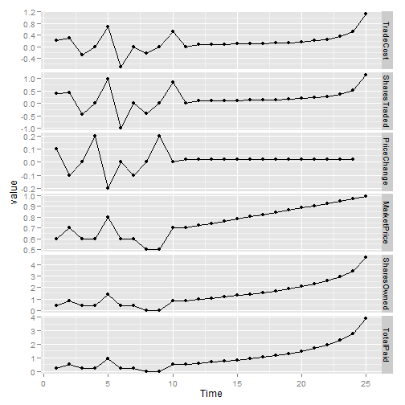
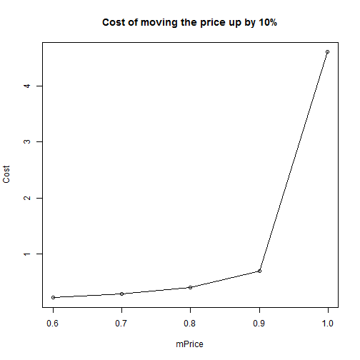
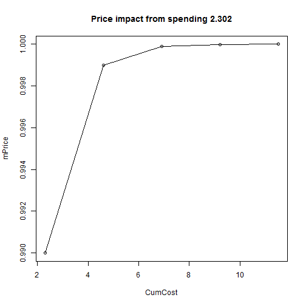
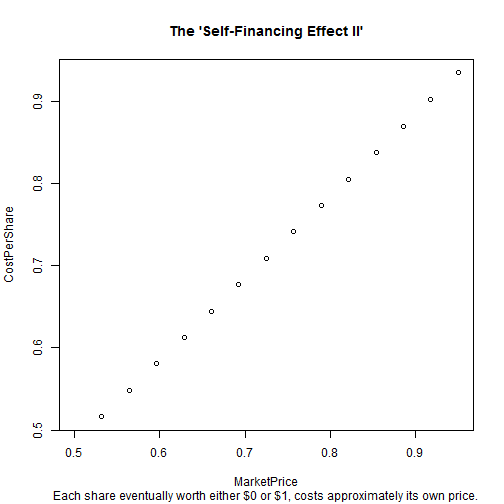

Trading Tests and Demo
========================================================
Paul Sztorc
Wed Dec 11 17:21:02 2013


```
## $Alice
## $Alice$Cash
## [1] 10
## 
## 
## $Bob
## $Bob$Cash
## [1] 50
```

```
## list()
```

```
## $Obama
## $Obama$Shares
## [1] 0 0
## 
## $Obama$Balance
## [1] 0.6931
## 
## $Obama$B
## [1] 1
## 
## $Obama$State
## [1] 0
## 
## 
## $Hillary
## $Hillary$Shares
## [1] 0 0 0 0
## 
## $Hillary$Balance
## [1] 4.852
## 
## $Hillary$B
## [1] 3.5
## 
## $Hillary$State
## [1] 0
```


Basics
-----------------------

```r

# Tests/Demo
ShowPrices("Obama")
```

```
## [1] 0.5 0.5
```

```r
ShowPrices("Hillary")
```

```
## [1] 0.25 0.25 0.25 0.25
```

```r

QueryMove("Obama", 1, 0.6)  #
```

```
## [1] 0.4055
```

```r
QueryMove("Hillary", 3, 0.3)  #higher B increases liquidity
```

```
## [1] 0.8796
```

```r

QueryCost("Obama", 2, 1)
```

```
## [1] 0.6201
```

```r
QueryCost("Hillary", 1, 1)
```

```
## [1] 0.278
```


1 Trader, 1 Contract
------------------------

```r

ResetAlice()

Simple <- CaptureSequence(c(0.6, 0.7, 0.6, 0.8, 0.6, 0.5, 0.7, seq(0.7, 0.99, 
    length.out = 15)))
```

```
## [1] "Bought 0.405465108108164 for 0.22314355131421 ."
## [1] "Bought 0.441832752279039 for 0.287682072451781 ."
## [1] "Sold 0.441832752279039 for 0.287682072451781 ."
## [1] "Bought 0 for 0 ."
## [1] "Bought 0.980829253011727 for 0.693147180559945 ."
## [1] "Sold 0.980829253011727 for 0.693147180559945 ."
## [1] "Bought 5.55111512312578e-17 for 0 ."
## [1] "Sold 0.405465108108164 for 0.22314355131421 ."
## [1] "Bought 0 for 0 ."
## [1] "Bought 0.847297860387203 for 0.510825623765991 ."
## [1] "Bought 0 for 0 ."
## [1] "Bought 0.100709599981039 for 0.071547151292048 ."
## [1] "Bought 0.10539939153182 for 0.077063348159595 ."
## [1] "Bought 0.111056909421247 for 0.0835017218453273 ."
## [1] "Bought 0.117931004780429 for 0.0911147885742218 ."
## [1] "Bought 0.12637245087021 for 0.10025660373965 ."
## [1] "Bought 0.136890694163733 for 0.111439561734209 ."
## [1] "Bought 0.150253599302245 for 0.125434182391903 ."
## [1] "Bought 0.167673693361383 for 0.14345539071051 ."
## [1] "Bought 0.191183379185065 for 0.167537760609717 ."
## [1] "Bought 0.22446914601268 for 0.20136975176465 ."
## [1] "Bought 0.274991770832285 for 0.252413933614323 ."
## [1] "Bought 0.360533711190985 for 0.338454397825206 ."
## [1] "Bought 0.537068333120982 for 0.515466003322492 ."
## [1] "Bought 1.14328830599328 for 1.1221427860783 ."
```

```r

MarketVisual(EmbellishRows(Simple))
```

```
## Loading required package: plyr
```

```
## Attaching package: 'reshape'
```

```
## The following object is masked from 'package:plyr':
## 
## rename, round_any
```

```
## Warning: Removed 1 rows containing missing values (geom_point).
```

```
## Warning: Removed 1 rows containing missing values (geom_path).
```

 


Trades Revealing Effect of LMSR
-----------------------------------

```r

# Set 1
ResetAlice()
```

```
## [1] "Sold 4.59511985013459 for 3.91202300542814 ."
```

```
## [1] -4.595 -3.912
```

```r
Users$Alice$Cash <- 1000  #lots of cash
Markets$Obama$Shares[1] <- 10  #force possibility of lower price
Markets$Obama$Shares[2] <- 10  #force possibility of lower price

MarketVisual(EmbellishRows(CaptureSequence(seq(0.5, 0.95, length.out = 30))))
```

```
## [1] "Bought 0 for 0 ."
## [1] "Bought 0.0620889040569406 for 0.0315262536467742 ."
## [1] "Bought 0.0622088126206357 for 0.0325526030377485 ."
## [1] "Bought 0.0624500250219402 for 0.033648034118233 ."
## [1] "Bought 0.0628153726486556 for 0.0348197651592272 ."
## [1] "Bought 0.0633092069321677 for 0.0360760564738101 ."
## [1] "Bought 0.0639375310674488 for 0.0374264055191169 ."
## [1] "Bought 0.064708187104106 for 0.0388817875442076 ."
## [1] "Bought 0.0656311095847872 for 0.0404549546923132 ."
## [1] "Bought 0.0667186616059432 for 0.0421608108242779 ."
## [1] "Bought 0.0679860755297703 for 0.0440168854167737 ."
## [1] "Bought 0.0694520293994216 for 0.0460439385014073 ."
## [1] "Bought 0.0711394026358256 for 0.0482667409698347 ."
## [1] "Bought 0.0730762727371737 for 0.0507150925790167 ."
## [1] "Bought 0.0752972414922493 for 0.0534251666735805 ."
## [1] "Bought 0.0778452195681041 for 0.0564413109049511 ."
## [1] "Bought 0.0807738603868984 for 0.0598184952109104 ."
## [1] "Bought 0.0841509318249436 for 0.0636256958802122 ."
## [1] "Bought 0.0880630716956023 for 0.0679506619085064 ."
## [1] "Bought 0.0926226339725051 for 0.072906770808089 ."
## [1] "Bought 0.0979777790265679 for 0.0786431273191113 ."
## [1] "Bought 0.104327751657969 for 0.0853598489511587 ."
## [1] "Bought 0.11194674823445 for 0.0933319397922183 ."
## [1] "Bought 0.121222589495924 for 0.102947969252442 ."
## [1] "Bought 0.132722157783267 for 0.114775514592429 ."
## [1] "Bought 0.147308054684803 for 0.129677823308533 ."
## [1] "Bought 0.166360362817795 for 0.149035579160488 ."
## [1] "Bought 0.192233828869892 for 0.175204089025089 ."
## [1] "Bought 0.229306019257475 for 0.212561441983674 ."
## [1] "Bought 0.286759137453178 for 0.270290329739909 ."
```

```
## Warning: Removed 1 rows containing missing values (geom_point).
```

```
## Warning: Removed 1 rows containing missing values (geom_path).
```

 

```r


# Self-Financing Effect
ResetAlice()
```

```
## [1] "Sold 2.94443897916644 for 2.30258509299404 ."
```

```
## [1] -2.944 -2.303
```

```r
SFE <- EmbellishRows(CaptureSequence(c(seq(0.5, 0.05, length.out = 25), seq(0.1, 
    0.5, length.out = 4), seq(0.5, 0.95, length.out = 15))))
```

```
## [1] "Bought 0 for 0 ."
## [1] "Bought 0 for 0 ."
## [1] "Bought 0 for 0 ."
## [1] "Bought 0.128748982744307 for 0.0664450994081527 ."
## [1] "Bought 0.129825005549403 for 0.0711762784678953 ."
## [1] "Bought 0.132032005410704 for 0.076633226020915 ."
## [1] "Bought 0.135487102192366 for 0.0829969195709683 ."
## [1] "Bought 0.140385837581004 for 0.0905140075408326 ."
## [1] "Bought 0.147031929332037 for 0.0995295953470325 ."
## [1] "Bought 0.155889694378283 for 0.110541874399825 ."
## [1] "Bought 0.167678012307801 for 0.124297716677576 ."
## [1] "Bought 0.183546688116127 for 0.141970261270387 ."
## [1] "Bought 0.205431045883016 for 0.165514438477572 ."
## [1] "Bought 0.236835181732154 for 0.198450938723838 ."
## [1] "Bought 0.284801358138052 for 0.247836163904582 ."
## [1] "Bought 0.365889025600815 for 0.330241686870577 ."
## [1] "Bought 0.530857110200369 for 0.496436886313889 ."
```

```r
SFE$CostPerShare <- SFE$TradeCost/SFE$SharesTraded
plot(TradeCost ~ MarketPrice, data = SFE, main = "The 'Self-Financing Effect'", 
    sub = "Cost to trade s.t. MarketPrice increases by 0.01551724.", xlim = c(0.55, 
        1))
```

 

```r
plot(CostPerShare ~ MarketPrice, data = SFE, main = "The 'Self-Financing Effect II'", 
    sub = "Each share eventually worth either $0 or $1, costs approximately its own price.")
```

 

```r

# In fact, setting the probability to 1 is always impossible (very
# realistic).
QueryMoveCost("Obama", 1, 1)
```

```
## [1] Inf
```

```r

# Set 2
ResetAlice()
```

```
## [1] "Sold 2.94443897916644 for 2.30258509299404 ."
```

```
## [1] -2.944 -2.303
```

```r

dLMSR2 <- rbind(Capture("Buy", "Alice", "Obama", 1, 0.8181818), Capture("Buy", 
    "Alice", "Obama", 1, 0.9), Capture("Buy", "Alice", "Obama", 1, 0.99), Capture("Buy", 
    "Alice", "Obama", 1, 0.999), Capture("Buy", "Alice", "Obama", 1, 0.9999))
```

```
## [1] "Bought 1.50407727455406 for 1.01160081167848 ."
## [1] "Bought 0.693147302782164 for 0.597837100755617 ."
## [1] "Bought 2.39789527279837 for 2.30258509299404 ."
## [1] "Bought 2.31163492851397 for 2.30258509299405 ."
## [1] "Bought 2.3034855883274 for 2.30258509299416 ."
```

```r

ResetAlice()
```

```
## [1] "Sold 9.21024036697596 for 8.51719319141635 ."
```

```
## [1] -9.210 -8.517
```

```r

dLMSR3 <- rbind(Capture("Buy", "Alice", "Obama", 1, 0.8181818), Capture("Buy", 
    "Alice", "Obama", 1, 0.9), Capture("Buy", "Alice", "Obama", 1, 0.94), Capture("Buy", 
    "Alice", "Obama", 1, 0.97), Capture("Buy", "Alice", "Obama", 1, 0.99), Capture("Buy", 
    "Alice", "Obama", 1, 0.991), Capture("Buy", "Alice", "Obama", 1, 0.992), 
    Capture("Buy", "Alice", "Obama", 1, 0.993), Capture("Buy", "Alice", "Obama", 
        1, 0.994), Capture("Buy", "Alice", "Obama", 1, 0.995), Capture("Buy", 
        "Alice", "Obama", 1, 0.996), Capture("Buy", "Alice", "Obama", 1, 0.997), 
    Capture("Buy", "Alice", "Obama", 1, 0.998), Capture("Buy", "Alice", "Obama", 
        1, 0.999), Capture("Buy", "Alice", "Obama", 1, 0.9999), Capture("Buy", 
        "Alice", "Obama", 1, 0.999999), Capture("Buy", "Alice", "Obama", 1, 
        0.99999999))
```

```
## [1] "Bought 1.50407727455406 for 1.01160081167848 ."
## [1] "Bought 0.693147302782164 for 0.597837100755617 ."
## [1] "Bought 0.554310735705728 for 0.510825623765989 ."
## [1] "Bought 0.724563376793323 for 0.693147180559945 ."
## [1] "Bought 1.11902116029932 for 1.09861228866811 ."
## [1] "Bought 0.106370106859179 for 0.105360515657827 ."
## [1] "Bought 0.118791608611268 for 0.117783035656384 ."
## [1] "Bought 0.134538949384822 for 0.133531392624523 ."
## [1] "Bought 0.15515722243866 for 0.154150679827259 ."
## [1] "Bought 0.183327087295972 for 0.182321556793953 ."
## [1] "Bought 0.224148071740217 for 0.223143551314211 ."
## [1] "Bought 0.28868558482902 for 0.28768207245178 ."
## [1] "Bought 0.406467614457791 for 0.405465108108164 ."
## [1] "Bought 0.694148682897037 for 0.693147180559947 ."
## [1] "Bought 2.3034855883274 for 2.30258509299416 ."
## [1] "Bought 4.60526919095906 for 4.60517018595922 ."
## [1] "Bought 4.60517117099259 for 4.60517018099209 ."
```

```r


dLMSR2 <- dLMSR2[-1, ]  # .5 to .81818 is nonrepresentative of this effect
dLMSR3 <- dLMSR3[-1, ]


plot(MarketPrice ~ Cash, main = "Price impact from spending 2.302", data = dLMSR2, 
    xlim = c(999, 988), axes = FALSE)
lines(dLMSR3$Cash, dLMSR3$MarketPrice)
axis(side = 2, at = c(0.9, 0.99, 0.999, 0.9999), las = 2)
axis(side = 1, at = seq(998, 980, by = -2.302), las = 2)
box()
```

 


```r

Users$Alice
```

```
## $Cash
## [1] 982.3
## 
## $Obama
## State1 
##  18.42
```

```r
FinalSell("Alice", "Obama", 1, 1, 9.21024)
```

```
## [1] "FinalSold 9.21024 for 9.21024 ."
```

```
## [1] -9.21 -9.21
```

```r
Users$Alice
```

```
## $Cash
## [1] 991.5
## 
## $Obama
## State1 
##   9.21
```

```r
Markets$Obama
```

```
## $Shares
## [1] 19.21 10.00
## 
## $Balance
## [1] 9.21
## 
## $B
## [1] 1
## 
## $State
## [1] 0
```


